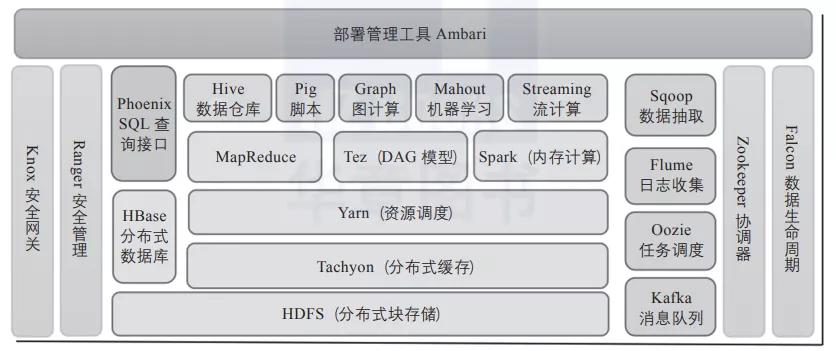

# Big Data

Hadoop生态圈

1)Hadoop基础功能库：支持其他Hadoop模块的通用程序包。

2)HDFS：一个分布式文件系统，能够以高吞吐量访问应用中的数据。

3)YARN：一个作业调度和资源管理框架。

4)MapReduce：一个基于YARN的大数据并行处理程序。

除了基本模块，Hadoop还包括以下项目。

1)Ambari：基于Web，用于配置、管理和监控Hadoop集群。支持HDFS、MapReduce、Hive、HCatalog、HBase、ZooKeeper、Oozie、Pig和Sqoop。Ambari还提供显示集群健康状况的仪表盘，如热点图等。Ambari以图形化的方式查看MapReduce、Pig和Hive应用程序的运行情况，因此可以通过对用户友好的方式诊断应用的性能问题。

2)Avro：数据序列化系统。

3)Cassandra：可扩展的、无单点故障的NoSQL多主数据库。

4)Chukwa：用于大型分布式系统的数据采集系统。

5)HBase：可扩展的分布式数据库，支持大表的结构化数据存储。

6)Hive：数据仓库基础架构，提供数据汇总和命令行即席查询功能。

7)Mahout：可扩展的机器学习和数据挖掘库。

8)Pig：用于并行计算的高级数据流语言和执行框架。

9)Spark：可高速处理Hadoop数据的通用计算引擎。Spark提供了一种简单而富有表达能力的编程模式，支持ETL、机器学习、数据流处理、图像计算等多种应用。

10)Tez：完整的数据流编程框架，基于YARN建立，提供强大而灵活的引擎，可执行任意有向无环图(DAG)数据处理任务，既支持批处理又支持交互式的用户场景。Tez已经被Hive、Pig等Hadoop生态圈的组件所采用，用来替代 MapReduce作为底层执行引擎。

11)ZooKeeper：用于分布式应用的高性能协调服务。

https://cloud.tencent.com/developer/article/2082414