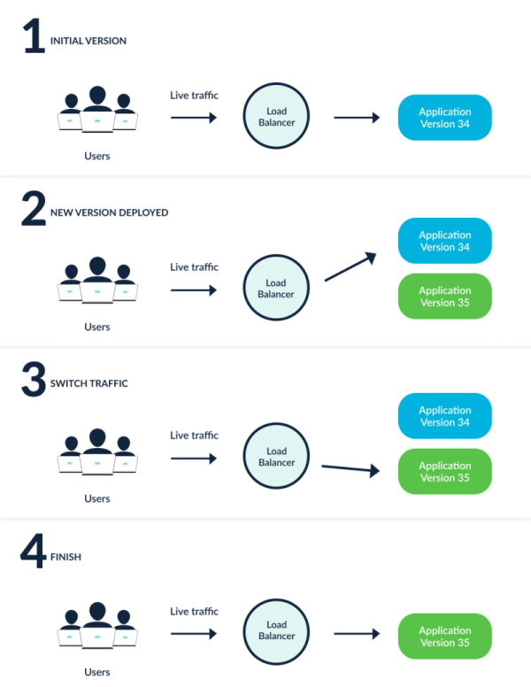
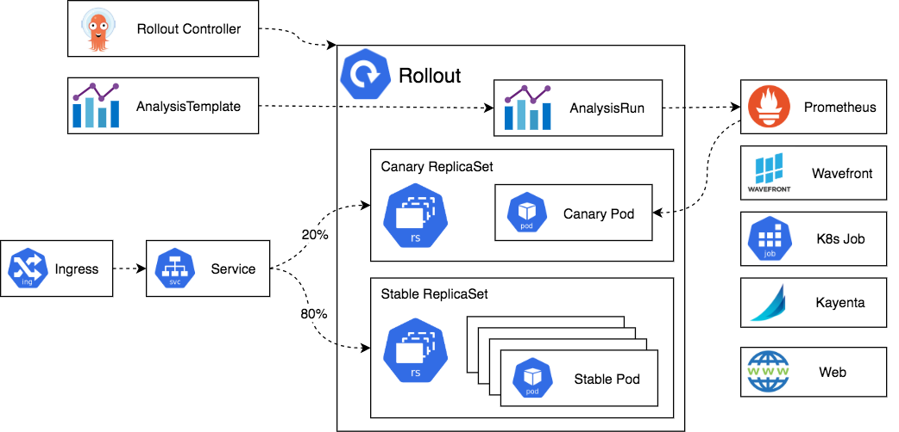

# Argo rollout

Argo Rollouts 是一个 Kubernetes Operator 实现，它为 Kubernetes 提供更加高级的部署能力，如蓝绿、金丝雀、金丝雀分析、实验和渐进式交付功能，为云原生应用和服务实现自动化、基于 GitOps 的逐步交付。

支持如下特性：

- 蓝绿更新策略
- 金丝雀更新策略
- 更加细粒度、加权流量拆分
- 自动回滚
- 手动判断
- 可定制的指标查询和业务 KPI 分析
- Ingress 控制器集成：NGINX，ALB
- 服务网格集成：Istio，Linkerd，SMI
- Metrics 指标集成：Prometheus、Wavefront、Kayenta、Web、Kubernetes Jobs、Datadog、New Relic

## 实现原理
与 Deployment 对象类似，Argo Rollouts 控制器将管理 ReplicaSets 的创建、缩放和删除，这些 ReplicaSet 由 Rollout 资源中的 spec.template 定义，使用与 Deployment 对象相同的 pod 模板。

当 spec.template 变更时，这会向 Argo Rollouts 控制器发出信号，表示将引入新的 ReplicaSet，控制器将使用 spec.strategy 字段内的策略来确定从旧 ReplicaSet 到新 ReplicaSet 的 rollout 将如何进行，一旦这个新的 ReplicaSet 被放大（可以选择通过一个 Analysis），控制器会将其标记为稳定。

如果在 spec.template 从稳定的 ReplicaSet 过渡到新的  ReplicaSet 的过程中发生了另一次变更（即在发布过程中更改了应用程序版本），那么之前的新 ReplicaSet 将缩小，并且控制器将尝试发布反映更新 spec.template 字段的 ReplicasSet。

## 相关概念

### Rollout
Rollout 是一个 Kubernetes 的 CRD 资源，相当于 Kubernetes Deployment 对象，在需要更高级的部署或渐进式交付功能的情况下，它旨在取代 Deployment 对象，Rollout 提供了 Kubernetes Deployment 所不能提供的功能。

- 蓝绿部署
- 金丝雀部署
- 与 Ingress 控制器和服务网格整合，实现高级流量路由
- 与用于蓝绿和金丝雀分析的指标提供者集成
- 根据成功或失败的指标，自动发布或回滚

### 渐进式交付
渐进式交付是以受控和渐进的方式发布产品更新的过程，从而降低发布的风险，通常将自动化和指标分析结合起来以驱动更新的自动升级或回滚。

渐进式交付通常被描述为持续交付的演变，将 CI/CD 中的速度优势扩展到部署过程。通过将新版本限制在一部分用户，观察和分析正确的行为，然后逐渐增加更多的流量，同时不断验证其正确性。

### 部署策略
虽然业界使用了一致的术语来描述各种部署策略，但这些策略的实现往往因工具而异，为了明确 Argo Rollouts 的行为方式，以下是 Argo Rollouts 提供的各种部署策略实施的描述。

- RollingUpdate(滚动更新)：慢慢地用新版本替换旧版本，随着新版本的出现，旧版本会慢慢缩减，以保持应用程序的总数量。这是 Deployment 对象的默认策略。
- Recreate(重新创建)：Recreate 会在启动新版本之前删除旧版本的应用程序，这可确保应用程序的两个版本永远不会同时运行，但在部署期间会出现停机时间。
- Blue-Green(蓝绿)：蓝绿发布（有时称为红黑）指同时部署了新旧两个版本的应用程序，在此期间，只有旧版本的应用程序会收到生产流量，这允许开发人员在将实时流量切换到新版本之前针对新版本进行测试。

- Canary(金丝雀)：金丝雀发布指将一部分用户暴露在新版本的应用程序中，而将其余流量提供给旧版本，一旦新版本被验证是正确的，新版本可以逐渐取代旧版本。Ingress 控制器和服务网格，如 NGINX Ingress 和 Istio，可以使金丝雀的流量拆分模式比原生的更复杂（例如，实现非常细粒度的流量分割，或基于 HTTP 头的分割）。

上面显示了一个有两个阶段的金丝雀（10%和33%的流量进入新版本），通过使用 Argo Rollouts，我们可以根据实际的使用情况定义确切的阶段数和流量百分比。

### 场景
用户希望在新版本开始为生产环境提供服务之前对其进行最后一分钟的功能测试，通过 BlueGreen 策略，Argo Rollouts 允许用户指定预览服务和活动服务，Rollout 将配置预览服务以将流量发送到新版本，同时活动服务继续接收生产流量。一旦达到要求，则可以将预览服务提升为新的活动服务。
在新版本开始接收实时流量之前，需要预先执行一套通用步骤，通过使用 BlueGreen 策略，用户可以在不接收来自活动服务的流量的情况下启动新版本，一旦这些步骤执行完毕，就可以将流量切换到新版本了。
用户希望在几个小时内将一小部分生产流量提供给他们应用程序的新版本。之后，他们希望缩小新版本规模，并查看一些指标以确定新版本与旧版本相比是否具有性能问题，然后他们将决定是否为切换到新版本。使用金丝雀策略，rollout 可以用新版本扩大 ReplicaSet 的规模，以接收指定百分比的流量，等待指定的时间，然后将百分比设置回 0，然后等待用户满意后再发布，为所有的流量提供服务。
一个用户想慢慢给新版增加生产流量，先给它一小部分的实时流量，然后等待一段时间再给新版本更多的流量，最终，新版本将接收所有生产流量。使用金丝雀策略，用户指定他们希望新版本接收的百分比以及在百分比之间等待的时间。
用户想要使用 Deployment 中的正常滚动更新策略，如果用户使用没有步骤的金丝雀策略，rollout 将使用 maxSurge 和最大不可用值来滚动到新版本。

## 架构
下面展示了由 Argo Rollouts 管理的 Deployment 的所有组件。

### Rollout Controller
这是主控制器，用于监视集群的事件并在 Rollout 类型的资源发生更改时做出反应。控制器将读取 rollout 的所有详细信息，并使集群处于 rollout 定义中描述的相同状态。

请注意，Argo Rollouts 不会篡改或响应正常 Deployment 资源上发生的任何变更，这意味着你可以在一个使用其他方法部署应用的集群中安装 Argo Rollouts。

### Rollout 资源
Rollout 资源是 Argo Rollouts 引入和管理的一种自定义 Kubernetes 资源，它与原生的 Kubernetes Deployment 资源基本兼容，但有额外的字段来控制更加高级的部署方法，如金丝雀和蓝/绿部署。

Argo Rollouts 控制器将只对 Rollout 资源中的变化做出反应，不会对正常的 Deployment 资源做任何事情，所以如果你想用 Argo Rollouts 管理你的 Deployment，你需要将你的 Deployment 迁移到Rollouts。

### 旧版和新版的 ReplicaSets
这些是标准的 Kubernetes ReplicaSet 资源的实例，Argo Rollouts 给它们添加了一些额外的元数据，以便跟踪属于应用程序的不同版本。

还要注意的是，参加 Rollout 的 ReplicaSet 完全由控制器自动管理，你不应该用外部工具来篡改它们。

### Ingress/Service
用户的流量进入集群后，被重定向到合适的版本，Argo Rollouts 使用标准的 Kubernetes Service 资源，但有一些额外的元数据。

Argo Rollouts 在网络配置上非常灵活，首先，可以在 Rollout 期间使用不同的服务，这些服务仅适用于新版本、仅适用于旧版本或两者都适用。特别是对于 Canary 部署，Argo Rollouts 支持多种服务网格和 Ingress 解决方案，用于按特定百分比拆分流量，而不是基于 Pod 数量进行简单的配置。

### Analysis 与 AnalysisRun
Analysis 是一种自定义 Kubernetes 资源，它将 Rollout 连接到指标提供程序，并为某些指标定义特定阈值，这些阈值将决定 Rollout 是否成功。对于每个 Analysis，你可以定义一个或多个指标查询及其预期结果，如果指标查询正常，则 Rollout 将继续操作；如果指标显示失败，则自动回滚；如果指标无法提供成功/失败的答案，则暂停发布。

Analysis 只是关于要查询哪些指标的模板。附加到 Rollout 的实际结果是 AnalysisRun 自定义资源，你可以在特定 Rollout 上或在集群上全局定义 Analysis 以供多个 rollout 共享。

请注意，在 Rollout 中使用 Analysis 和指标是完全可选的，你可以通过 API 或 CLI 手动暂停和促进发布或使用其他外部方法（例如冒烟测试）。你不需要仅使用 Argo Rollouts 的 Metrics 解决方案，你还可以在 Rollout 中混合自动（即基于 Analysis）和手动步骤。

除了指标之外，你还可以通过运行 Kubernetes Job 或运行 webhook 来决定发布的成功与否。

### Metric Providers
Argo Rollouts 包括几个流行的指标提供者的原生集成，你可以在 Analysis 资源中使用，来自动提升或回滚发布。

### CLI 和 UI（图中未显示）
还可以使用 Argo Rollouts CLI 或集成 UI 查看和管理 Rollout，两者都是可选的。