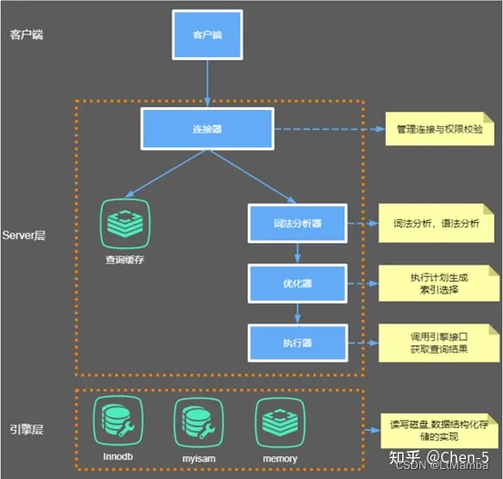
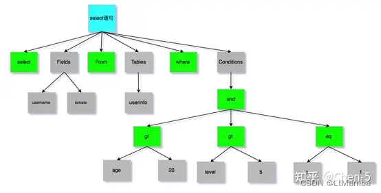
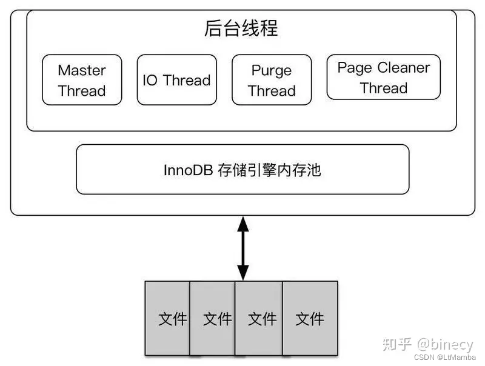
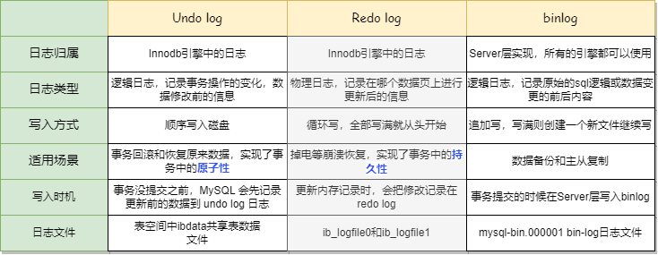
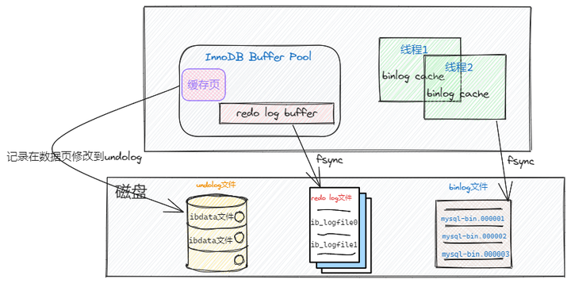
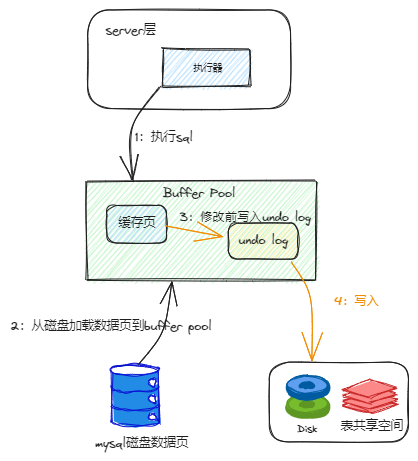

# MySQL

## 架构


- 连接池组件 – Connection Pool

- 管理服务和工具组件 – Management Services & utilities

- SQL接口组件 – SQL Interface

- 查询分析器组件 – Praser

- 优化器组件 – Optimizer

- 缓冲组件 – Caches & Buffers

- 插件式表存储引擎 – Pluggable Storage Enginess

- 物理文件 – Files & Logs

## MySQL语句执行步骤



连接器（即架构图中连接池）
负责客户端与服务端进行连接的工作。

### 查询缓存

MySQL收到一个查询请求后，会先到查询缓存里检查一下，之前是不是执行过这条语句。
注意：
MySQL8.0 已经移除了查询缓存功能。

### 词法分析器

查询缓存没有命中的话，就会开始真正执行SQL语句了。也就是第三步：词法分析器。
SQL经过分析器分析以后会生成类似如下的一个语法树：



至此分析器的工作任务也基本完成了，接下来进入到优化器。

### 优化器

SQL语句经过分析器分析后，在开始执行之前，还要先经过优化器的处理。
优化器是在表里面有多个索引的时候，决定使用哪个索引；
或者在一个语句有多表关联（join）的时候，决定各个表的连接顺序；
以及一些mysql自己内部的优化机制。
最终 优化器会选择一个最优的查询路径。

### 执行器

这里面包含两步：

#### 发送
把查询优化器选择的结果作为任务发送给底层的存储引擎去真正的执行。
我们的数据放在内存或者磁盘，存储引擎其实就是执行 sql 语句的，他会按照一定的步骤查询内存缓存数据，更新磁盘数据等。
也就是说 索引什么的都是存储引擎这里用的。下文详解。

#### 接收
不断接收 存储引擎已经执行过的语句的结果，返回给相应的任务（即对应的查询请求任务）。
由 MySql 语句执行步骤可知存储引擎至关重要。

## InnoDB引擎



## Mysql 高级日志binlog、undoLog、redoLog 



undolog、redolog都是InnoDB引擎中的日志，而且都是在Buffer Pool中，而binlog在Server层中，位于每条线程中，并且每种日志在磁盘中的的归档方式和文件都是不一样的，之间的区别如下图。



WAL机制是什么？

WAL，全称是Write-Ahead Logging， 预写日志系统。指的是 MySQL 的写操作并不是立刻更新到磁盘上，而是先记录在日志上，然后在合适的时间再更新到磁盘上。

MySQL真正使用WAL的原因是：磁盘的写操作是随机IO，比较耗性能，所以如果把每一次的更新操作都先写入log中，那么就成了顺序写操作，实际更新操作由后台线程再根据log异步写入。

这样对于client端，延迟就降低了。并且，由于顺序写入大概率是在一个磁盘块内，这样产生的IO次数也大大降低。所以WAL的核心在于将随机写转变为了顺序写，降低了客户端的延迟，提升了吞吐量。

CheckPoint技术是啥？

在MySQL中主要是将缓冲池中的脏页刷回到磁盘。InnoDB存储引擎内部，两种checkpoint，分别为:Sharp Checkpoint 和 Fuzzy Checkpoint。

而MYSQL中主要是为了保证数据会做很多CheckPoint动作

### Undo log

undo log 叫做回滚日志，它保证了事务的 ACID 特性中的原子性（Atomicity），是引擎层生成的日志，记录的是逻辑操作，用于记录数据被修改前的信息，这里的逻辑操作是指： "增（insert）删（delete）改（update）"。

undo log的两个主要作用是【事务回滚】 和 通过ReadView + undo log 实现 【MVCC (多版本并发控制)】

记录内容
不同的SQL修改操作，记录的undo log分别是什么呢？

insert 插入操作，会在undo log中记录本次插入的主键id，等事务回滚时，会delete此主键对应的记录，

update 更新操作，会记录一条相反的update的undo log，回滚时执行一次相反update，更新回原来的数据，

delete 删除操作，会记录删除前的数据，回滚时，insert原来的数据。

通过上面的相反逻辑处理，这样的话即使发生错误时，就能回滚到事务之前的数据状态。

一条SQL没有begin开启事务和Commit提交事务，也能自己提交事务？

是的，MYSQL事务分为【隐式事务和显示事务】

隐式事务：

比如insert、update、delete语句，事务的开启、提交或回滚由mysql内部自动控制的，事务自动开启、提交或回滚。

我们可以通过 show variables like 'autocommit'查看是否开启了自动提交，autocommit为ON表示开启了自动提交

显示事务:

显式事务是指在应用程序中明确指定事务的开始和结束，使用BEGIN、COMMIT和ROLLBACK语句来控制事务的执行，语法如下：

```
BEGIN;
-- SQL statements
COMMIT;
```



事务回滚
一条记录的每一次更新操作产生的 undo log 格式都有一个 roll_pointer 指针和一个 trx_id 事务id，如下图：


通过 trx_id 可以知道该记录是被哪个事务修改的；
通过 roll_pointer 指针可以将这些 undo log 串成一个链表，这个链表就被称为版本链
而事务发生回滚，会读取 undo log里的数据，本质上并不会以执行反SQL的模式还原数据，而是直接将roll_ptr回滚指针指向的Undo记录。

来看insert和update产生的日志

插入的数据都会生成一条insert undo log，并且数据的回滚指针会指向它。undo log会记录undo log的序号、插入主键的列和值…

MVCC
MVCC 是通过 ReadView + undo log 实现的。undo log 为每条记录保存多份历史数据，MySQL 在执行快照读（普通 select 语句）的时候，会根据事务的 Read View 里的信息，顺着 undo log 的版本链找到满足其可见性的记录。


