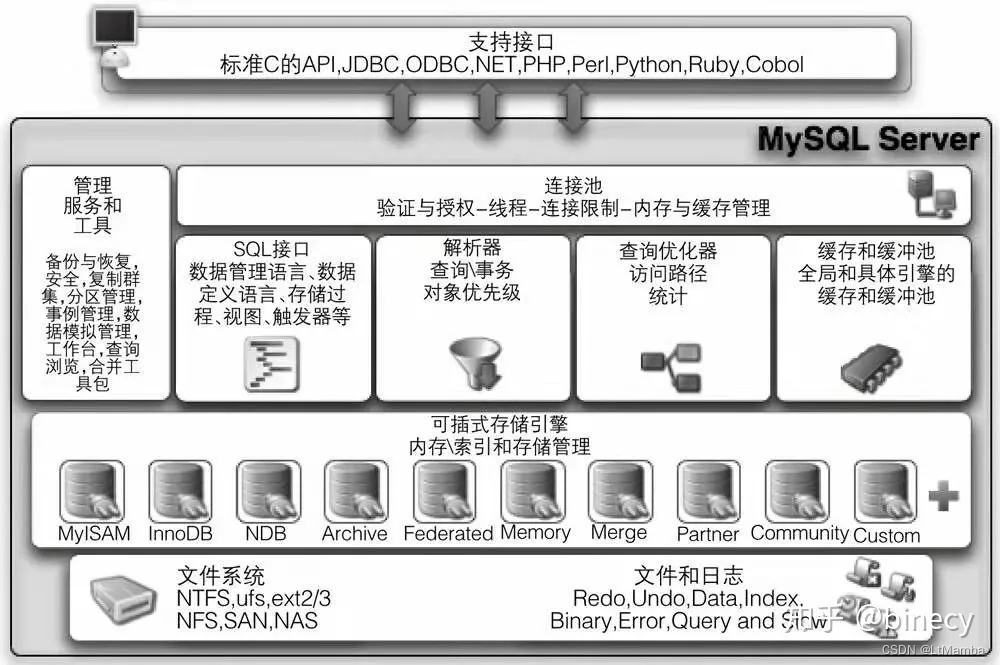
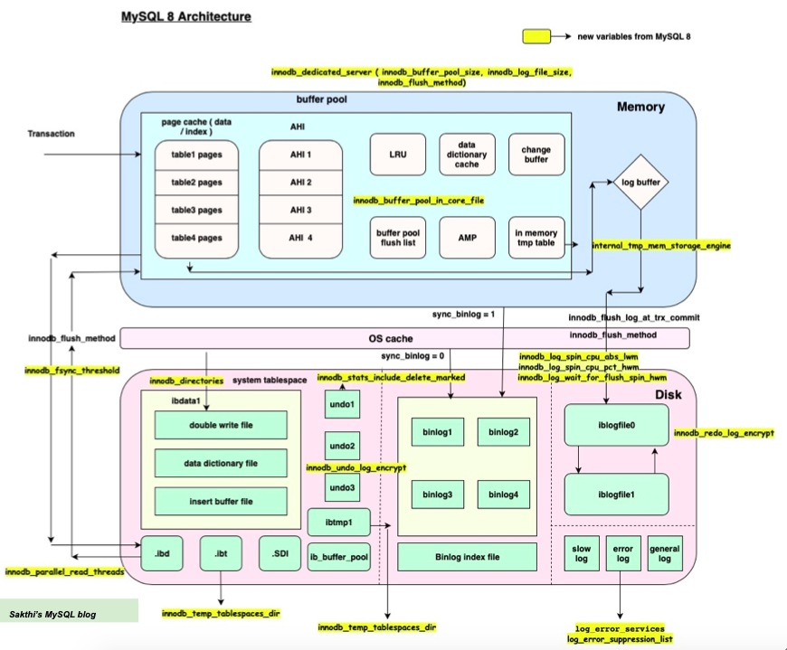

# MySQL

## 架构

- 连接池组件 – Connection Pool

- 管理服务和工具组件 – Management Services & utilities

- SQL接口组件 – SQL Interface

- 查询分析器组件 – Praser

- 优化器组件 – Optimizer

- 缓冲组件 – Caches & Buffers

- 插件式表存储引擎 – Pluggable Storage Enginess

- 物理文件 – Files & Logs

## [MySQL语句执行步骤](./mysql-sql-execute.md)

## [InnoDB引擎](./innodb.md)

## [MySQL日志binlog、undoLog、redoLog](./binlog-undolog-redolog.md)

## [事务](./txn.md)

## [锁](./lock.md)
