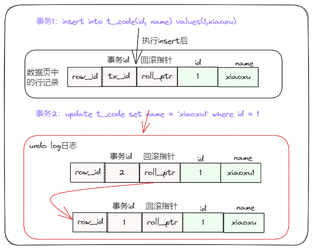
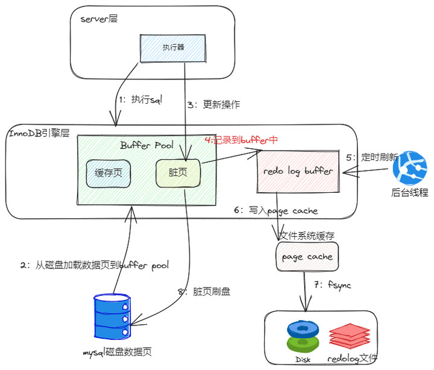
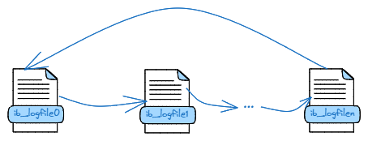
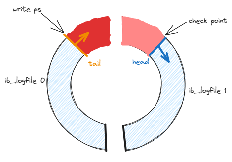
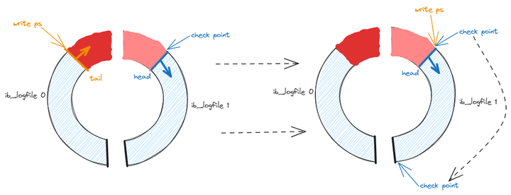
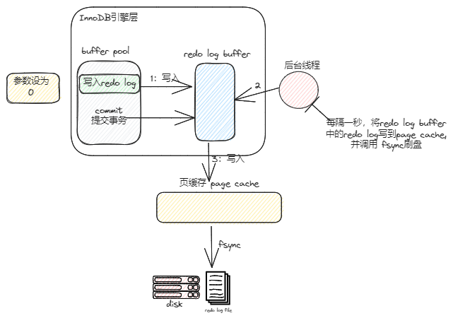
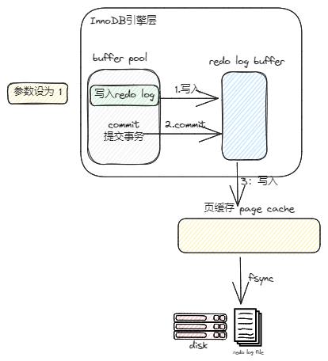
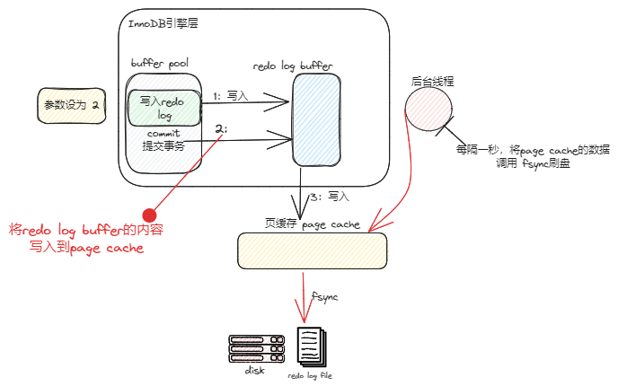
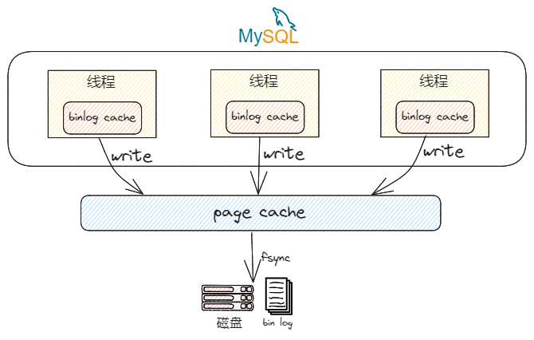
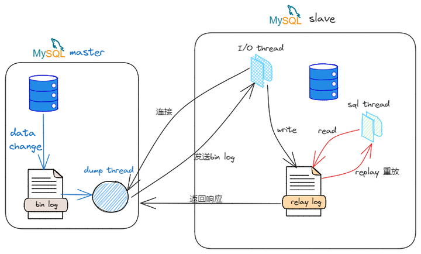

## MySQL日志binlog、undoLog、redoLog


undolog、redolog都是InnoDB引擎中的日志，而且都是在Buffer Pool中，而binlog在Server层中，位于每条线程中，并且每种日志在磁盘中的的归档方式和文件都是不一样的，之间的区别如下图。


WAL机制是什么？

WAL，全称是Write-Ahead Logging， 预写日志系统。指的是 MySQL 的写操作并不是立刻更新到磁盘上，而是先记录在日志上，然后在合适的时间再更新到磁盘上。

MySQL真正使用WAL的原因是：磁盘的写操作是随机IO，比较耗性能，所以如果把每一次的更新操作都先写入log中，那么就成了顺序写操作，实际更新操作由后台线程再根据log异步写入。

这样对于client端，延迟就降低了。并且，由于顺序写入大概率是在一个磁盘块内，这样产生的IO次数也大大降低。所以WAL的核心在于将随机写转变为了顺序写，降低了客户端的延迟，提升了吞吐量。

CheckPoint技术是啥？

在MySQL中主要是将缓冲池中的脏页刷回到磁盘。InnoDB存储引擎内部，两种checkpoint，分别为:Sharp Checkpoint 和 Fuzzy Checkpoint。

而MYSQL中主要是为了保证数据会做很多CheckPoint动作

### Undo log

undo log 叫做回滚日志，它保证了事务的 ACID 特性中的原子性（Atomicity），是引擎层生成的日志，记录的是逻辑操作，用于记录数据被修改前的信息，这里的逻辑操作是指： "增（insert）删（delete）改（update）"。

undo log的两个主要作用是【事务回滚】 和 通过ReadView + undo log 实现 【MVCC (多版本并发控制)】

记录内容
不同的SQL修改操作，记录的undo log分别是什么呢？

insert 插入操作，会在undo log中记录本次插入的主键id，等事务回滚时，会delete此主键对应的记录，

update 更新操作，会记录一条相反的update的undo log，回滚时执行一次相反update，更新回原来的数据，

delete 删除操作，会记录删除前的数据，回滚时，insert原来的数据。

通过上面的相反逻辑处理，这样的话即使发生错误时，就能回滚到事务之前的数据状态。

一条SQL没有begin开启事务和Commit提交事务，也能自己提交事务？

是的，MYSQL事务分为【隐式事务和显示事务】

隐式事务：

比如insert、update、delete语句，事务的开启、提交或回滚由mysql内部自动控制的，事务自动开启、提交或回滚。

我们可以通过 show variables like 'autocommit'查看是否开启了自动提交，autocommit为ON表示开启了自动提交

显示事务:

显式事务是指在应用程序中明确指定事务的开始和结束，使用BEGIN、COMMIT和ROLLBACK语句来控制事务的执行，语法如下：

```
BEGIN;
-- SQL statements
COMMIT;
```


事务回滚
一条记录的每一次更新操作产生的 undo log 格式都有一个 roll_pointer 指针和一个 trx_id 事务id，如下图：


通过 trx_id 可以知道该记录是被哪个事务修改的；
通过 roll_pointer 指针可以将这些 undo log 串成一个链表，这个链表就被称为版本链
而事务发生回滚，会读取 undo log里的数据，本质上并不会以执行反SQL的模式还原数据，而是直接将roll_ptr回滚指针指向的Undo记录。

来看insert和update产生的日志

插入的数据都会生成一条insert undo log，并且数据的回滚指针会指向它。undo log会记录undo log的序号、插入主键的列和值



## MVCC

MVCC 是通过 ReadView + undo log 实现的。undo log 为每条记录保存多份历史数据，MySQL 在执行快照读（普通 select 语句）的时候，会根据事务的 Read View 里的信息，顺着 undo log 的版本链找到满足其可见性的记录。

Redo log
在InnoDB存储引擎中，大部分redo log记录的是物理日志，记录的是某个数据页做了什么修改。

为什么说大部分是物理日志呢？

因为redo log日志主要包括两部分：

一是在内存中重做日志缓冲（redo log Buffer）易丢失，在内存中， 二是重做日志文件（redo log file），保存在磁盘中。

为何需要redo log
我们知道buffer pool 确实提高了读写效率没错，但是问题来了，Buffer Pool 是基于内存的，而内存总是不可靠，万一断电重启，还没来得及落盘的脏页数据就会丢失。

也正由于该原因，redo log应运而生！

因为redo log就是来解决这个问题的，它是搭配buffer pool 缓冲池、change buffer 使用的，作用就是持久化记录的写操作，防止在写操作更新到磁盘前发生断电丢失这些写操作，直到该操作对应的脏页真正落盘。

知识充电站：缓冲池 buffer pool 的作用是缓存磁盘上的数据页，减少磁盘的IO；change buffer 的作用是将写操作先存在内存中，等到下次需要读取这些操作涉及到的数据页时，就把数据页加载到缓冲池中，然后在缓冲池中更新，然后由后台线程再刷写到磁盘。

总结起来就是【持久化防止断电数据丢失】，从而保证了事务四大特性中的持久性。

和undolog的区别
这里我们可以看出redo log和undo log之间的一些明显区别，文章开头我们也总结过，这里再回顾下更清晰！

两种日志是属于 InnoDB 存储引擎的日志，主要区别在于

redo log 记录了此次事务「完成后」的数据状态，记录的是更新之后的值
undo log 记录了此次事务「开始前」的数据状态，记录的是更新之前的值
写入流程



这里写入redo log buffer就用到了开头提到的WAL（Write-Ahead Logging）技术，日志先写入redo log buffer缓冲区，然后被后台进程刷盘。而不用等脏页刷入磁盘，通过先将redo log持久化到磁盘中，即使系统奔溃，脏页刷盘失败，也可以通过redo log 的内容，将数据恢复到当前最新的状态。

checkpoint

我们知道redo log 默认情况下存储在data目录下ib_logfile0和ib-logfile1两个文件中，其实可以通过 innodb_log_file_size 设置大小， innodb_log_files_in_group 设置文件个数。比如可以配置为一组4个文件ib_logfile0到ib_logfile3，每个文件的大小是 1GB，整个redo log 日志文件组可以记录4G的内容。



为什么默认情况下 redo log由ib_logfile0和ib-logfile1两个日志文件？

主要是MySQL通过来回写这两个文件的形式记录redo log日志，用两个日志文件组成一个“环形”，如下图：



redo log是采用循环写的方式，图中各部分代表的意思如下：

write pos：表示当前redo log文件写到了哪个位置。
check point：表示目前哪些redo log记录已经失效且可以被擦除（覆盖）
write pos 和 checkpoint 的移动都是顺时针方向；
write pos ～ checkpoint 之间的部分（图中的红色部分），用来记录新的更新操作；
check point ～ write pos 之间的部分（图中蓝色部分），待落盘的脏数据页记录；
红色和蓝色部分如何理解呢？

write pos和check point两根指针中间区域，也就是图中的红色区域，代表是可以写入日志记录的可用空间，而蓝色区域则表示日志落盘但数据还未落盘的记录。

举个例子：当一个事务写了redo log日志、并将数据写入缓冲区后，但数据还未写入磁盘文件中，此时这个事务对应的redo log记录就为上图中的蓝色，而当一个事务所写的数据也落盘后，对应的redo log记录就会变为红色

write pos指针追上check point指针怎么办



如果write pos指针追上check point指针，那么环中的红色区域就没了，也就意味着无法再写入redo log日志了，因为文件满了，再执行写入操作就会阻塞MYSQL。

此时会触发checkpoint刷盘机制，将Buffer Pool 中的脏页刷新到磁盘中，然后标记 redo log 哪些记录可以被擦除，接着对旧的 redo log 记录进行擦除，等擦除完旧记录腾出了空间，checkpoint 就会往后移动，红色区域也会不断增长，因此阻塞的写事务才能继续执行。

刷盘时机和策略
缓存在 redo log buffer 里的 redo log 是在内存中的，最终是要刷到磁盘中，下面⑤种场景会刷新到磁盘中：

log buffer空间不足时：log buffer的大小是有限的，如果当前写入log buffer的redo日志量已经占满了log buffer总容量的50%左右，就需要将这些日志刷新到磁盘中。

事务提交时：为了保持持久性，必须要把页面修改时所对应的redo日志刷新到磁盘，否则系统崩溃后，无法将该事务对页面所做的修改恢复过来。

将某个脏页刷新到磁盘前，会先保证该脏页对应的redo日志刷新到磁盘中：redo日志是顺序写入的，因此在将某个脏页对应的redo日志从redo log buffer刷新到磁盘中时，也会保证将在其之前产生的redo日志也刷新到磁盘中。

后台线程：大约以每秒一次的频率将redo log buffer中的redo日志刷新到磁盘中。

触发checkpoint时。

什么是【刷盘策略】，可以理解为何时以何种方式刷新到真正的redo log file 中。

InnoDB通过innodb_flush_log_at_trx_commit 参数可以控制策略，该参数控制 commit 提交事务时，如何将 redo log buffer中的日志刷新到 redo log file 中，它支持设定0，1， 2也就是说支持三种策略设置，不同的值代表的意思如下。

如何查看mysql默认策略呢

```
show variables like 'innodb_flush_log_at_trx_commit'
//在不改动的情况下 innodb_flush_log_at_trx_commit值是1
```

设置不同的 innodb_flush_log_at_trx_commit 值的时候输盘策略流程图如下：

设置为0（延迟写） ：每次事务提交时不主动进行刷盘操作，redo log依然留在redo log buffer中，然后每秒写入page cache中，然后持久化到磁盘中



设置为1 (实时写，实时刷)：每次事务提交时都将直接讲缓存在redo log buffer中的redo log直接持久化到磁盘中（ 默认值 ）



设置为2（实时写，延时刷） ：表示每次事务提交时都只把 redo log buffer 内容写入 page cache，不进行同步，由os自己决定什么时候同步到磁盘文件




崩溃恢复
MySQL 崩溃也是一次关闭过程，只是比正常关闭突然和迅速了一些。正常关闭时，MySQL 会做一系列收尾工作，例如：清理 undo 日志、合并 change buffer 缓冲区等操作。

在MySQL服务器正常的时候undo log看起来是个累赘，但是万一出问题就是个宝，可以在重启的时候恢复到奔溃钱的状态，主要通过以下步骤：

**找到 last_checkpoint_lsn：**读取 Redo 日志之前，必须先确定一个起点，这个起点就是 InnoDB 最后一次 checkpoint 操作的 lsn，也就是 last_checkpoint_lsn。

修复损坏的数据页：两次写文件中的所有数据页都加载到内存缓冲区之后，需要用这些页来把系统表空间、独立表空间、undo 表空间中损坏的数据页恢复到正常状态。

读取 Redo 日志：确定了读取 Redo 日志的起点 last_checkpoint_lsn，接下来就该读取 Redo 日志了

应用 Redo 日志

## Binlog

bin log 主要是记录所有对数据库表结构变更和表数据修改的操作，对于select、show这类读操作并不会记录。

bin log 是在事务提交后再服务层产生的日志，主要作用有两个：

数据恢复 ：Binlog 详细记录了所有修改数据的 SQL，当某一时刻的数据误操作而导致出问题，或者数据库宕机数据丢失，那么可以根据 Binlog 来回放历史数据。

主从复制： 想要做多机备份的业务，可以去监听当前写库的 Binlog 日志，同步写库的所有更改。

格式类型
bin log日志有三种格式，分别为statement、row和mixed。

在 MySQL 5.7.7之前，默认的格式是statement，MySQL 5.7.7之后，默认值是row。日志格式通过binlog-format指定。


statement 模式：每一条修改数据的 SQL 都会被记录到 bin log 中。 由于只记录对数据库产生变更操作的SQL，日志不会太大，性能会比较不错。但是如果在SQL中使用了sysdate()、now()这类函数， 在恢复数据、主从同步数据时，有时会出现数据不一致的情况 row 模式：不再记录每条造成变更的SQL语句，而是记录具体哪一个分区中的、哪一个页中的、哪一行数据被修改了。 所以就没有statement模式下动态函数问题，缺点是每行数据变化都会被记录，bin log日志文件会比较大 mixed模式： statement 和 row 模式的结合版，它会根据不同的情况自动使用 row 模式和 statement 模式

写入方式
binlog是通过追加的方式进行写入的，可以通过max_binlog_size参数设置每个binlog文件的大小，当文件大小达到给定值之后，会生成新的文件来保存日志。

每个日志文件的命名为mysql-bin.000001、mysql-bin.000002、mysql-bin.00000x....，可以通过show binary logs;命令查看已有的bin-log日志文件。

刷盘时机和策略
事务执行时，会给每个线程在内存中分配一块地方叫bin log cache，binlog文件就记录在这里，事务提交的时候，再把bin log cache写到bin log文件中。注意，一个事务的bin log不能被拆开提交，无论这个事务多大，也要确保一次性写入，这样才能保证原子性。而对于 InnoDB 存储引擎而言，只有在事务提交时才会记录bin log ，此时记录还在内存中。

我们来看看在内存中的bin log何时保存到磁盘中，也就是【刷盘时机】



图中 fsync，就是将数据持久化到磁盘的操作，而write还只是把日志写到page cache的bin log文件中，还没有持久化到磁盘。

write 和fsync的时机和频率，是由参数sync_binlog控制，该参数控制着二进制日志写入磁盘的过程，该参数的有效值为0 、1、N

sync_binlog = 0 ：提交事务都只 write，不 fsync，此时数据在page cache，后续交由操作系统决定何时将数据持久化到磁盘
sync_binlog = 1 ：提交事务都会 write，然后马上执行 fsync
sync_binlog =N(N>1) ：提交事务都 write，但累积 N 个事务后才 fsync
从上面可以看出，syncbinlog 最安全的是设置是1 ，但是将这个参数设为1以上的数值会提高数据库的性能的损耗，而操作系统默认设置的是sync_binlog = 0。

主从复制
主从复制主要是依赖bin log，slave从库从master主库读取bin log进行数据同步。

MySQL主从复制是异步且串行化的 ，也就是说主库上执行事务操作的线程不会等待复制 binlog 的线程同步完成，流程如下图：



整个流程其实就是对bin log的写入、同步、重做过程。

写入：主库写 bin log 日志，提交事务，并更新本地存储数据。
同步：把 bin log 复制到所有从库上，每个从库把 bin log 写到中继（relay log）日志中。
重做：重做中继日志 bin log events，并更新存储引擎中的数据。
主从同步设计当然有好处了，比如**读写分离（数据写入在master上，数据读取在slave）、数据备份（保留了多份一样的数据）。**但是如果 slave增加，从库连接上来的I/O线程较多，那么就会对主库资源消耗增大，造成主从延迟。

当然造成主从延迟的原因还有很多咯，网络问题，带宽问题，慢SQL等，这些就不进行过多说明，朋友们私下去了解吧！

主从复制方式
同步复制：MySQL 主库提交事务的线程要等待所有从库的复制成功响应，才返回客户端结果。这种方式在实际项目中，基本上没法用，原因有两个：一是性能很差，因为要复制到所有节点才返回响应；二是可用性也很差，主库和所有从库任何一个数据库出问题，都会影响业务。

异步复制（默认模型）：MySQL 主库提交事务的线程并不会等待 binlog 同步到各从库，就返回客户端结果。这种模式一旦主库宕机，数据就会发生丢失。

半同步复制：MySQL 5.7 版本之后增加的一种复制方式，介于两者之间，事务线程不用等待所有的从库复制成功响应，只要一部分复制成功响应回来就行，比如一主二从的集群，只要数据成功复制到任意一个从库上，主库的事务线程就可以返回给客户端。这种半同步复制的方式，兼顾了异步复制和同步复制的优点，即使出现主库宕机，至少还有一个从库有最新的数据，不存在数据丢失的风险。

为什么有了 binlog， 还要有 redo log？

其实redo log、bin log都是记录更新数据库的操作，为啥要设计两个日志呢，这个问题跟 MySQL 的时间线有关系。

最开始 MySQL 里并没有 InnoDB 引擎，MySQL 自带的引擎是 MyISAM，但是 MyISAM 没有 crash-safe 的能力，binlog 日志只能用于归档。

InnoDB引擎 是另一个公司以插件形式引入 MySQL 的，而MYSQL的bin log没有灾难恢复能力，所以 InnoDB 使用 redo log 来实现 crash-safe 能力，确保任何事务提交后数据都不会丢失。