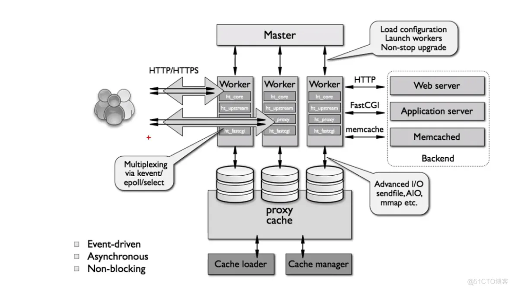
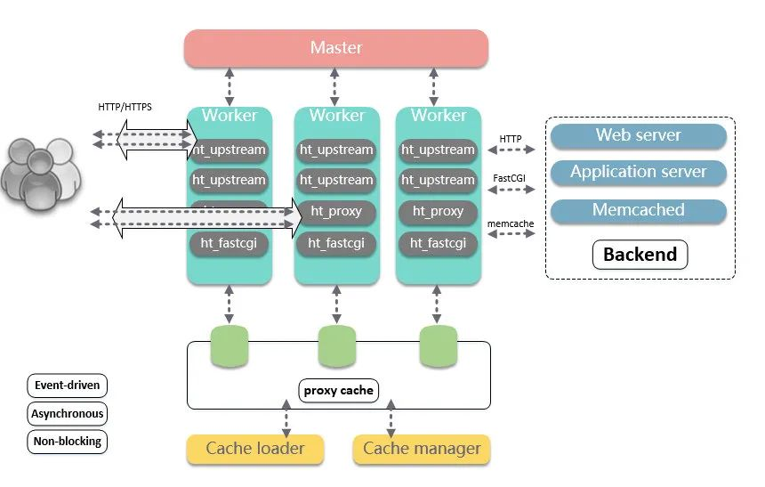
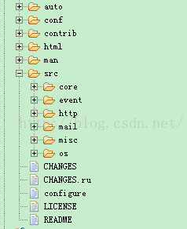
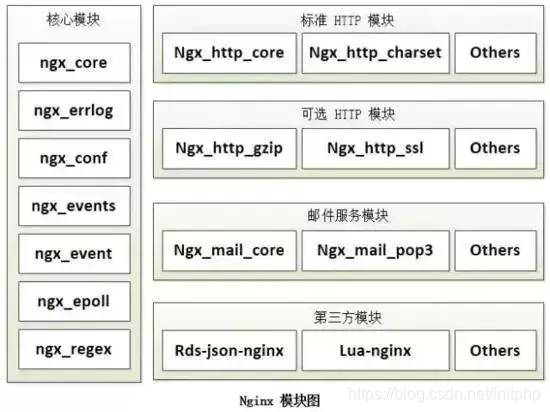

# Nginx 

## Nginx架构

master 负责管理 worker 进程，worker 进程负责处理网络事件。整个框架被设计为一种依赖事件驱动、异步、非阻塞的模式。

如此设计的优点：

1.可以充分利用多核机器，增强并发处理能力。
2.多 worker 间可以实现负载均衡。
3.Master 监控并统一管理 worker 行为。在 worker 异常后，可以主动拉起 worker 进程，从而提升了系统的可靠性。并且由 Master 进程控制服务运行中的程序升级、配置项修改等操作，从而增强了整体的动态可扩展与热更的能力。

## Nginx代码组织

Nginx的源码主要分布在src/目录下，而src/目录下主要包含三部分比较重要的模块。

core：包含了Nginx的最基础的库和框架。包括了内存池、链表、hashmap、String等常用的数据结构。
event：事件模块。Nginx自己实现了事件模型。而我们所熟悉的Memcached是使用了Libevent的事件库。自己实现event会性能和效率方便更加高效。
http：实现HTTP的模块。实现了HTTP的具体协议的各种模块，该部分内容量比较大。

## Nginx模块设计

高度模块化的设计是Nginx的架构基础。Nginx服务器被分解为多个模块，每个模块就是一个功能模块，只负责自身的功能，模块之间严格遵循“高内聚，低耦合”的原则。

