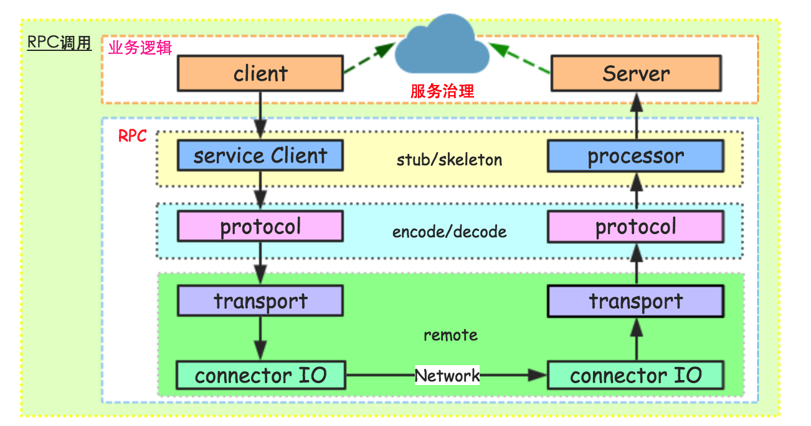

# RPC

通用的RPC组件一般包括以下一些模块：

serviceClient：这个模块主要是封装服务端对外提供的API，让客户端像使用本地API接口一样调用远程服务。一般，我们使用动态代理机制，当客户端调用api的方法时，serviceClient会走代理逻辑，去远程服务器请求真正的执行方法，然后将响应结果作为本地的api方法执行结果返回给客户端应用。类似RMI的stub模块。

processor：在服务端存在很多方法，当客户端请求过来，服务端需要定位到具体对象的具体方法，然后执行该方法，这个功能就由processor模块来完成。一般这个操作需要使用反射机制来获取用来执行真实处理逻辑的方法，当然，有的RPC直接在server初始化的时候，将一定规则写进Map映射中，这样直接获取对象即可。类似RMI的skeleton模块。

protocol：协议层，这是每个RPC组件的核心技术所在。一般，协议层包括编码/解码，或者说序列化和反序列化工作；当然，有的时候编解码不仅仅是对象序列化的工作，还有一些通信相关的字节流的额外解析部分。序列化工具有：hessian，protobuf，avro,thrift，json系，xml系等等。在RMI中这块是直接使用JDK自身的序列化组件。

transport：传输层，主要是服务端和客户端网络通信相关的功能。这里和下面的IO层区分开，主要是因为传输层处理server/client的网络通信交互，而不涉及具体底层处理连接请求和响应相关的逻辑。

I/O：这个模块主要是为了提高性能可能采用不同的IO模型和线程模型，当然，一般我们可能和上面的transport层联系的比较紧密，统一称为remote模块。

此外，还有业务代码自己去实现的client和server层。client当需要远程调用服务时，会首先初始化一个API接口代理对象，然后调用某个代理方法。server在对外暴露服务时，需要首先实现对应API接口内部的方法，当请求过来时，通过反射找到对应的实例对象，执行对应的业务代码。