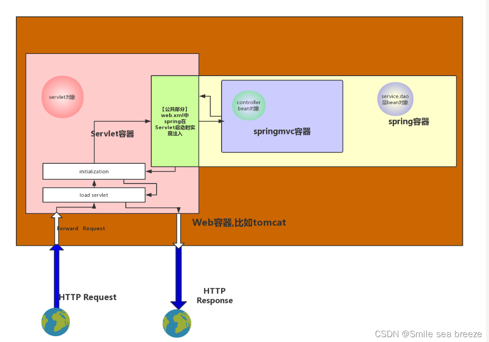
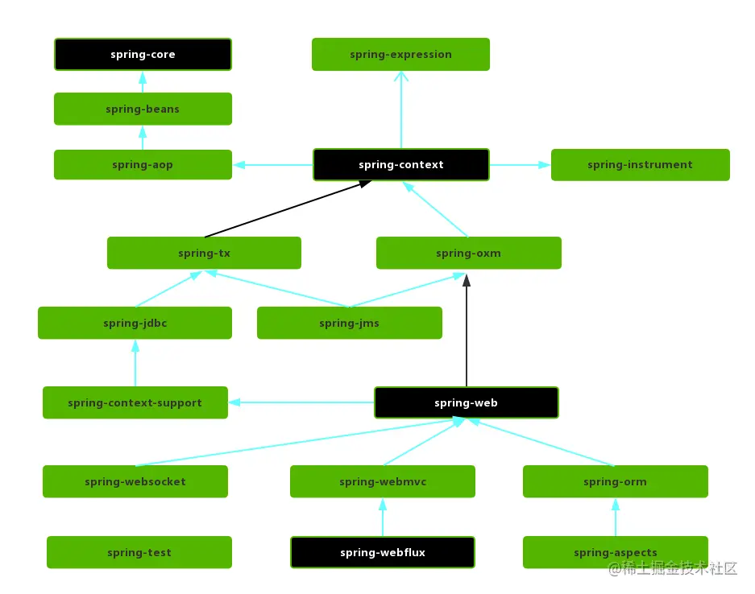

# Spring

## Spring历史

Spring框架的发展历程可以追溯到2002年，当时J2EE和EJB大行其道，但Rod Johnson认为EJB过于臃肿，不适合所有项目。他提出了一种基于普通Java类和依赖注入的更简单解决方案，并编写了超过30000行的基础结构代码，命名为com.interface21，这就是Spring的前身。2003年，Rod Johnson和同伴开发了一个全新的框架，命名为Spring，旨在为Java企业应用程序开发提供一种更简单、可扩展的解决方案。12

Spring的发展经历了几个重要阶段：

Spring 1.x时期（2002年-2006年）：最初版本的Spring框架发布于2002年，提供了IoC容器和AOP框架两个核心功能。

Spring 2.x时期（2006年-2009年）：2006年发布的Spring 2.0版本引入了很多新功能，如注解驱动的开发模式、SpringMVC框架、JDBC模板等，使Spring成为Java应用程序开发的事实标准。

Spring 3.x时期（2009年-2013年）：2010年发布的Spring 3.0版本进一步加强了Spring框架的功能和性能，引入了Java 5的特性支持、REST风格的Web服务支持等。

Spring 4.x时期（2013年-2018年）：2013年发布的Spring 4.0版本进一步强化了Spring框架的性能和功能，支持Java 8的新特性，引入了WebSocket支持等。

Spring 5.x时期（2018年至今）：2017年发布的Spring 5.0版本引入了对响应式编程的支持，并对Spring框架的核心组件进行了重构和升级，以提高框架的性能和可扩展性。

Spring的盈利方式包括提供全球的巡回课程演讲和相关的服务，包括24 × 7的技术支持、高品质的培训、软件咨询服务以及保障企业用户风险投资。此外，Spring还通过销售提供完整功能的企业版本来盈利。

## Tomcat & Spring & SpringMVC

- web容器中有servlet容器，spring项目部署后存在spring容器和springmvc容器。
其中spring控制service层和dao层的bean对象。
- springmvc容器控制controller层bean对象。
- servlet容器控制servlet对象。
- 项目启动是，首先 servlet初始化，初始化过程中通过web.xml中spring的配置加载spring配置，初始化spring容器和springmvc容器。
- 待容器加载完成。servlet初始化完成，则完成启动。
- HTTP请求到达web容器后，会到达Servlet容器，容器通过分发器分发到具体的spring的Controller层。执行业务操作后返回结果。

## Spring Framework 架构

### 核心容器（Core Container）

核心容器提供了Spring框架的基本功能，是其它模块建立的基础，有 spring-core、spring-beans、spring-context、spring-context-support和spring-expression（Expression Language、SpEL）组成。spring-beans和spring-core是spring框架的核心模块。

#### spring-core

提供了框架的基本组成部分，包括控制翻转(Inversion of Control, IOC)和依赖注入(Dependency Injection, DI)功能。
spring-beans
提供了BeanFactory，BeanFactory接口是spring框架中的核心接口，它是工厂模式的经典实现。BeanFactory使用控制翻转对应用程序的配置和依赖性规范与实际的应用程序代码进行了分离。但BeanFactory容器实例化后并不会自动创建实例化Bean，只有当Bean被使用的时候BeanFactory容器才会对该Bean进行实例化与依赖关系的装配。

#### spring-context

spring-context模块构架与spring-core和spring-beans模块之上，提供了一个框架式的对象访问方式，是访问定义和配置的任意对象的媒介。它扩展了BeanFactory，为其增加了Bean生命周期控制、框架事件体系以及资源加载透明化等功能。
ApplicationContext是该模块的核心接口，它是BeanFactory的子类，与BeanFactory不同的是ApplicationContext容器实例化后会自动对所有的单实例Bean进行实例化与依赖关系的装配，使之处于待用状态。

#### spring-context-support
用于将常见的第三方库集成到spring应用程序上下文中。该模块提供了高速缓存、任务调度、邮件访问等支持。

#### spring-expression
该模块是对JSP2.1规范中规定的统一表达式语言EL的扩展模块，它提供了强大的表达式语言去支持运行时查询和操作运行中的对象，该语言支持设置和获取属性值、属性分配、方法调用、访问数组、集合和索引器的内容、逻辑和算术运算、变量命名以及从Spring的IOC容器中以名称检索对象。它还支持列表投影、选择以及常用的列表聚合。
它的语法类似于传统的EL，但提供了额外的功能。最出色的要数函数调用和简单字符串的模板函数。这种语言的特性是基于 spring 产品的需求而设计，  他可以非常方便地同 spring IOC 进行交互。

### AOP 和设备支持（AOP）

由spring-aop、spring-aspects和 spring-instrument 3个模块组成。

#### spring-aop

spring-aop 是spring的另一个核心模块，提供了一个符合AOP要求的面相切面的编程实现。作为继OOP之后，对程序员影响最大的编程思想之一，AOP极大的开拓了人们对于编程的思路。
在spring中，以JDK动态代理的技术为基础，设计出了一系列的AOP横切实现，比如：前置通知、返回通知和异常通知等。同时使用 Pointcut 接口匹配切入点，可以使用现有的切入点设计横切面；也可以扩展相关方法根据需求进行切入，将代码按照功能进行分离，以便干净的解耦。
#### spring-aspects

提供了与AspectJ的集成功能，主要是为AOP提供了多种实现方法。

#### spring-instrument

该模块是spring-aop的一个支援模块，提供了类植入(Instrumentation)支持和类加载器的实现。主要作用于JVM启动时，生成一个代理类，程序员通过代理类在运行时修改类的字节，从而改变一个类的功能，实现AOP的功能。

### 数据访问与集成（Data Access/Integration）

由spring-jdbc、spring-orm、spring-oxm、spring-jms和spring-tx组成。
#### spring-jdbc
spring-jdbc模块是spring提供的JDBC抽象层，消除了繁琐的编码以及数据库厂商特有的错误代码解析。用于简化JDBC，主要提供JDBC的模板方法、关系数据库对象化方式、事务管理来简化JDBC编程，主要实现类有JdbcTemplate、SimpleJdbcTemplate以及NamedParameterJdbcTemplate。
#### spring-orm
spring-orm模块是ORM的支持模块，主要集成Hibernate、Java Persistence API(JPA)和Java Data Object(JDO)用于资源管理、数据访问对象（DAO）的实现和事务策略。
#### spring-oxm
spring-oxm模块主要提供一个抽象层支撑OXM(Object-to-XML-Mapping)，例如：JAXB、Castor、XMLBeans、JiBX和XStream等。
#### spring-jms
spring-jms模块（Java Message Service）为Java消息传递服务，能够发送和接收信息，自Spring Framework 4.1 以后，它还提供了对spring-messaging模块的继承。
#### spring-tx
spring-tx模块是spring-jdbc事务控制实现模块，支持用于实现所有接口和所有POJO(普通Java对象)类的编程和声明式事务的管理。

### Web
由spring-websocket、spring-webmvc、spring-web和spring-webflux组成
#### spring-web
spring-web模块为spring提供了最基础的web支持，主要建立在核心容器之上，通过Servlet或者Listeners来初始化IOC容器以及Web应用上下文，自动装载WebApplicationContext，也包含一些与web相关的支持，如：Struts集成类、文件上传支持的类、FIlter类和大量辅助工具类。
#### spring-webmvc
也称web-servlet模块，包含用于Web应用程序的Spring MVC和REST Web Service实现。Spring MVC框架提供了领域模型代码和Web表单之间的清晰分离，并与Spring Framework的所有其他功能集成。
#### spring-websocket
Spring4.0以后新增的模块，实现双工异步通讯协议，实现了WebSocket和SocketJS，提供Socket通信和Web端的推送功能。
#### spring-webflux
是一个新的非堵塞函数式Reactive Web框架，可以用来建立异步的，非阻塞，事件驱动的服务，并且扩展性非常好。

### 消息（Messaging）
#### spring-messaging
spring-messaging 是从 Spring4.0 开始新加入的一个模块，主要职责是为 Spring 框架集成一些基础的报文传送应用。
### Test
#### spring-test
spring-test模块主要为测试提供支持的，毕竟在不需要发布（程序）到你的应用服务器或者连接到其他企业设施的情况下能够执行一些集成测试或者其他测试对于任何企业都是非常重要的。

