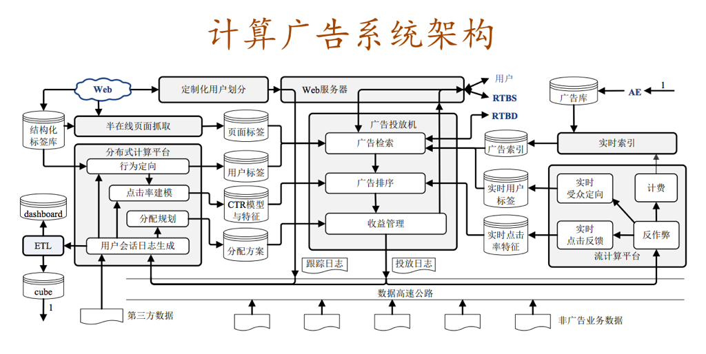

# 计算广告

广告投放引擎
一般来说，广告系统的投放引擎采用类搜索的架构，即检索加排序的两阶段决策过程。广告投放引擎还有一个独特模块–从全局优化的角度对整体收益进行管理。广告投放引擎的主要模块有以下几个：

广告投放机。接受广告前端Web服务器发来的请求，完成广告投放决策并返回最后页面片段的主逻辑。最重要的指标是每秒数(QPS)以及广告决策的延迟（latency）；
广告检索。在线时根据用户标签与页面标签从广告索引中查找符合条件的广告候选。广告检索的候选将被送入广告排序模块。
广告排序。在线高效地计算广告的eCPM，并进行排序的模块。eCPM的计算主要依赖于点击率估计，需要用到离线计算得到的CTR模型和特征，可能用到实时点击率特征。
收益管理。代表那些在各种广告系统中将局部广告排序的广告进行进一步调整，以全局收益最优为目的做调整的功能。
广告请求接口。
定制化用户划分。
数据高速公路
将在线投放的数据准实时传输到离线分布式计算平台与流式计算平台，供后续处理和建模使用。由于在进行受众定向建模时需要用到广告系统以外的其他用户产品日志，或者第三方提供的数据，数据高速公路也担负着收集这些数据源的任务。

离线数据处理
离线数据处理有两个输出目标：一是统计日志得到报表、仪表盘等，供人进行决策时作为参考；二是利用数据挖掘、机器学习技术进行受众定向、点击率预估、分配策略规划等，为在线的机器决策提供支持。离线数据处理的主要模块有下面几个：

用户会话日志生成。从各个渠道收集来的日志，先整理成以用户ID为键的统一存储格式，把这样的日志称为用户会话日志。
行为定向。完成挖掘用户日志，根据日志中的行为给用户打上结构化标签库中的某些标签，并将结果存储在用户标签的在线缓存中，供广告投放机使用。
上下文定向。这部分包括半在线页面抓取和页面标签的缓存，这部分与行为定向互相配合，负责给上下文页面打上标签，用于在线的广告投放中。
点击率建模。在分布式计算平台上训练得到点击率的模型参数和相应特征，加载到缓存中供线上投放系统决策时使用。
分配规划。为在线的收益管理模块提供服务，它根据广告系统全局优化的具体需求，利用离线日志数据进行规划，得到适合线上执行的分配方案。
商业智能系统。包括ETL过程、仪表盘和Cube。这些是所有以人为最终接口的数据处理和分析流程额总括，担负着对外信息交流的任务。
广告管理系统。广告操作者，即客户执行（AE）与广告系统的接口。AE通过广告管理系统定制和调整广告投放，并且与数据仓库交互，获得投放统计数据以支持决策。
在线数据处理
在线数据处理可以认为是离线数据处理的镜像功能，它是为了满足广告系统对实时数据反馈的要求，解决那些离线分布式计算平台无法快速响应的计算问题。包含的主要模块有：

在线反作弊。实时判断流量来源中是否有作弊流量，并将这部分流量从后续的计价和统计中去除掉，是广告业务非常重要的部分，是所有后续在线数据处理必须经过的前置模块。
计费。
在线行为反馈。包括实时受众定向和实时点击反馈等部分。这部分是将短时内发生的用户行为和广告日志及时地加工成用户标签，以及实时的点击率模型特征。
实时索引。实时接受广告投放数据，建立倒排索引。