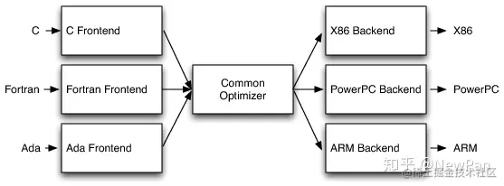
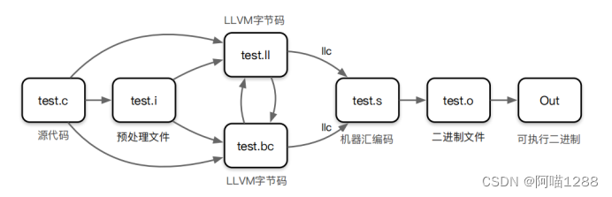
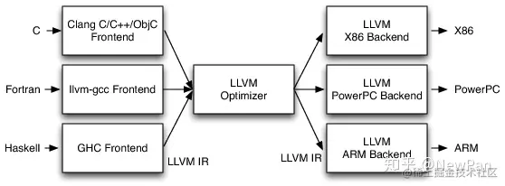
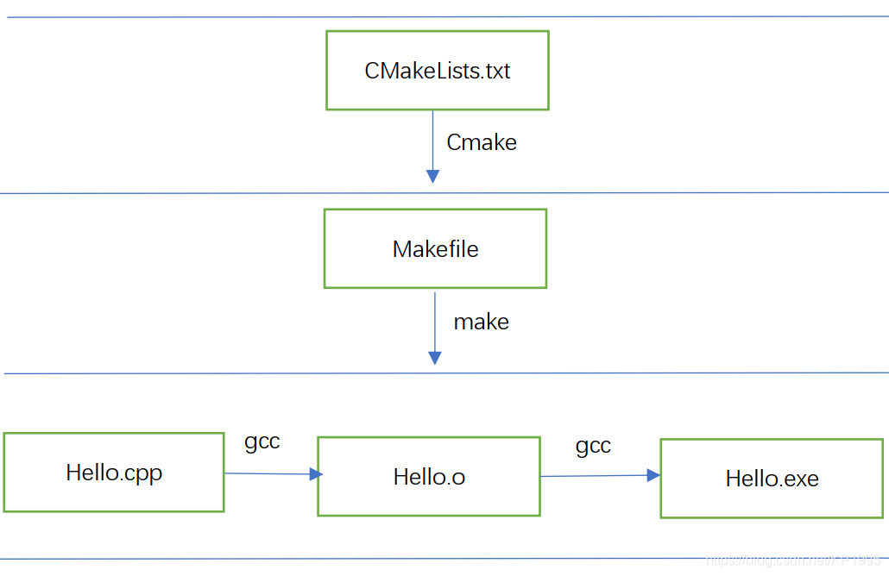

# C++

## Releases Notes

- C++98：这是第一个 ANSI/ISO 标准化的 C++ 版本，发布于 1998 年。它基于 Bjarne Stroustrup 于 1985 年创建的原始 C++ 设计，并加入了一些重要特性，如 STL（标准模板库）、异常处理、I/O Streams、命名空间和 RTTI（运行时类型识别）。
- C++03：这个版本主要是对 C++98 的一些修正和改进，发布于 2003 年，并未引入新的语言特性，所以一般不把它当做重要版本，存在感也不强。
- C++11：这是 C++ 历史上最重大的更新之一，有时被称为 C++0x（因为它原计划在 200x 年发布，一直跳票）。它引入了大量新特性，如自动类型推断（auto 关键字）、基于范围的 for 循环、Lambda 表达式、智能指针、并发支持、移动语义、nullptr 和更强大的模板功能等。
- C++14：作为 C++11 的小幅度更新，C++14 引入了一些改进和新特性，包括泛型 Lambda 表达式、返回类型推导、二进制字面量、数字分隔符、弃用属性等。
- C++17：这个版本进一步提升了 C++ 的功能和易用性，新功能不是很多，引入了结构化绑定、if constexpr、std::optional、std::variant、std::string_view、并行算法等特性。
- C++20 是继 C++11 之后又一个重大更新，引入了概念（concepts）、范围库（ranges）、协程（coroutines）、模块（modules）、三元运算符的改进、constexpr 的增强、std::span 等新特性。
- C++23 是 2023 年 7 月份刚确定下的新标准，目前能完整支持 C++23 的编译器基本没有。变化包括引入标准库的模块化支持、扩展 constexpr 、增加并行算法、ranges 扩展、this 推导、引入更多的属性和注解、增加 std::mdspan、std::generator 等新特性。

https://www.runoob.com/cplusplus/cpp-inheritance.html

## Compile

### gcc/g++

1.预处理(Preprocessing)
预处理用于将所有的#include头文件以及宏定义替换成其真正的内容，预处理之后得到的仍然是文本文件，但文件体积会大很多。gcc的预处理是预处理器cpp来完成的，你可以通过如下命令对test.c进行预处理：

gcc -E -I./inc test.c -o test.i
或者直接调用cpp命令

$ cpp test.c -I./inc -o test.i
上述命令中-E是让编译器在预处理之后就退出，不进行后续编译过程；-I指定头文件目录，这里指定的是我们自定义的头文件目录；-o指定输出文件名。

经过预处理之后代码体积会大很多：

X	文件名	文件大小	代码行数
预处理前	test.c	146B	9
预处理后	test.i	17691B	857
预处理之后的程序还是文本，可以用文本编辑器打开。

2.编译(Compilation)
这里的编译不是指程序从源文件到二进制程序的全部过程，而是指将经过预处理之后的程序转换成特定汇编代码(assembly code)的过程。编译的指定如下：

$ gcc -S -I./inc test.c -o test.s
上述命令中-S让编译器在编译之后停止，不进行后续过程。编译过程完成后，将生成程序的汇编代码test.s，这也是文本文件，内容如下：

3.汇编(Assemble)
汇编过程将上一步的汇编代码转换成机器码(machine code)，这一步产生的文件叫做目标文件，是二进制格式。gcc汇编过程通过as命令完成：

$ as test.s -o test.o
等价于：

gcc -c test.s -o test.o
这一步会为每一个源文件产生一个目标文件。因此mymath.c也需要产生一个mymath.o文件

4.链接(Linking)
链接过程将多个目标文以及所需的库文件(.so等)链接成最终的可执行文件(executable file)。

命令大致如下：

$ ld -o test.out test.o inc/mymath.o ...libraries...

（1）前端：解析源代码、检查语法错误、翻译为抽象的语法树
（2）优化器：将抽象语法树翻译生成中间代码，并对中间代码进行优化
（3）后端：将优化器优化后的中间代码转换为目标机器的代码，通用功能包括指令选择、寄存器分配和指令调度

架构优势
（1）使用通用的中间代码，新增支持语言只需要新增一个前端，新增支持目标机器只需要新增一个后端
（2）针对前后端，开发人员技术栈不同，开发人员只需要关注自身的技术栈，有利于让更多人员参与进来

架构缺陷
（1）GCC的三段式模块必须配套使用，很难做到部分重用
（2）不能将 GCC 部分功能作为库重用的原因有很多，包括滥用全局变量、不可变变量不能更改限制不严、设计不良的数据结构、庞大的代码库、以及使用宏来防止代码库一次编译可以支持多个编译前端-目标机对。不过，最难解决的问题是其早期设计和那个时代所固有的架构设计。具体来说，GCC 饱受分层问题和抽象漏洞的困扰：编译后端遍历编译前端抽象语法树（AST）来生成调试信息（debug info），编译前端生成编译后端数据的结构，整个编译器依赖命令行设置的全局数据结构。

### clang/llvm

1.LLVM的提出是为了解决编译器代码重用的问题
2.LLVM是三段式编译器优化器+后端的SDK集合，提供了一系列对外接口供开发者调用
（1）前端：支持各种组件的前端（Clang、llvm-gcc、GHC），需要遵守LLVM的规则，输出中间代码LLVM IR
（2）优化器：LLVM IR通过一系列分析和优化从而改进代码，然后输入代码生成器生成目标机器码
（3）后端：将优化器优化后的中间代码转换为目标机器的代码

3.架构优势
（1）LLVM IR既有清晰地规范，又是与优化器的唯一接口。这就意味着为 LLVM 编写编译前端唯一要做的就是生成 LLVM IR。由于LLVM IR具有一流的文本格式，构建一个将 LLVM IR 作为文本输出的前端既可行又合理
（2）在设计完 LLVM IR 之后，LLVM 下一个重要的点就是要把 LLVM 设计成一系列独立的库，而不是像 GCC 那样的不可分离命令行编译器以优化器的设计为例：它将 LLVM IR 作为输入，然后逐步处理输入并生成执行效率更高的 LLVM IR。LLVM 优化器（和其他编译器一样）以流水线的方式为输入做不同的优化。常见的例子是内联（替换调用位置的函数实体）、重新组合表达式、移动循环不变代码等等。根据优化级别，运行不同程度的优化：例如 -O0 是不做优化，-O3 将运行 67 道优化程序（LLVM 2.8 版本）。
（3）LLVM 优化器基于库的设计可以让我们可以灵活选择要组合的优化程序以及自定义优化程序之间的执行顺序
（4）多目标机兼容的 LLVM 代码生成器的设计，LLVM 的代码生成器将代码生成分为多个独立的过程——指令选择、寄存器分配、调度、代码布局优化和代码组装
（5）使用BugPoint减少测试用例
三、Clang的简介
1.Clang是一个C、C++、Objective-C和Objective-C++编程语言的编译器前端
2.底层是由LLVM作为后端
3.Clang项目包括Clang前端和Clang静态分析器等，目的是输出代码对应的抽象语法树并将代码编译成LLVM bitcode
4.接着后端使用LLVM编译成平台相关的机器语言
四、LLVM\Clang\GCC之间的关系
1.Clang在前端生成的抽象语法树是GCC内存的20%
2.Clang + LLVM = GCC
3.LLVM提供了灵活的代码复用能力，将编译后端的算法封装成为了一个个独立的模块并提供对外接口，而GCC传统编译器耦合很重，很难小粒度复用代码

### gcc & cmake & makefile

https://blog.csdn.net/KP1995/article/details/109569787
https://www.cnblogs.com/xuelisheng/p/9988626.html

gcc是GNU Compiler Collection的缩写（就是GNU编译器套件），也可以简单认为是编译器，它可以编译很多种编程语言（括C、C++、Objective-C、Fortran、Java等等）。当你的程序只有一个源文件时，直接就可以用gcc命令编译它。但当你的程序包含很多个源文件时，用gcc命令逐个去编译时，你就很容易混乱而且工作量大，所以出现了make工具。

2.什么是make
make工具可以看成是一个智能的批处理工具，它本身并没有编译和链接的功能，而是用类似于批处理的方式—通过调用makefile文件中用户指定的命令来进行编译和链接。

3.什么是Makefile
简单的说就像一首歌的乐谱，make工具就像指挥家，指挥家根据乐谱指挥整个乐团怎么样演奏，make工具就根据makefile中的命令进行编译和链接。makefile命令中就包含了调用gcc（也可以是别的编译器）去编译某个源文件的命令。makefile在一些简单的工程完全可以用人工手写，但是当工程非常大的时候，手写makefile也是非常麻烦的，如果换了个平台makefile又要重新修改。这时候就出现了Cmake工具。

4.什么是Cmake
cmake可以更加简单的生成makefile文件给上面那个make用。当然cmake还有其他功能，就是可以跨平台生成对应平台能用的makefile，你就不用再自己去修改了。cmake根据什么生成makefile呢？它又要根据一个叫CMakeLists.txt文件（学名：组态档）去生成makefile。到最后CMakeLists.txt文件谁写啊？亲，是你自己手写的。

当然如果你用IDE，类似VS这些一般它都能帮你弄好了，你只需要按一下那个三角形。

5.简单总结
5.1 cmake用来转译CMakeLists.txt，在linux下它会生成Makefile，来给make执行。

5.2 Makefile+make可理解为类unix环境下的项目管理工具， 而cmake是抽象层次更高的项目管理工具。

5.3 下面给出其关系图：

