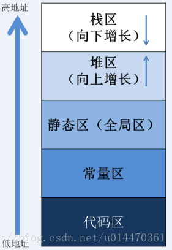

# C

https://www.runoob.com/cprogramming/c-tutorial.html

## 内存

### 内存最小存储单元以及内存最小计量单元是什么

内存最小存储单元是Bit（二进制位）

内存最小计量单元是Byte（字节）

### 描述一下内存分区

程序在运行前：代码区、BSS段（为未初始化数据区）、data段（初始化数据区）；

程序在运行后：堆区、栈区、全局区（静态区）、代码区、文字常量区。

代码区：存放程序的代码，即CPU执行的机器指令，并且是只读的。

常量区：存放常量(程序在运行的期间不能够被改变的量，例如: 10，字符串常量”abcde”， 数组的名字等)

静态区（全局区）：静态变量和全局变量的存储区域是一起的，一旦静态区的内存被分配, 静态区的内存直到程序全部结束之后才会被释放

堆区：由程序员调用malloc()函数来主动申请的，需使用free()函数来释放内存，若申请了堆区内存，之后忘记释放内存，很容易造成内存泄漏

栈区：存放函数内的局部变量，形参和函数返回值。栈区之中的数据的作用范围过了之后，系统就会回收自动管理栈区的内存(分配内存 , 回收内存),不需要开发人员来手动管理。栈区就像是一家客栈，里面有很多房间，客人来了之后自动分配房间，房间里的客人可以变动，是一种动态的数据变动。

### stack栈与heap堆的区别

stack栈由系统自动分配，其地址和容量是系统定的，是一块连续的内存（Window下是2M）；

heap堆是用户自己用malloc申请的，char p = (char)malloc()，它是不连续的。

### malloc()与new()的区别

malloc

是在堆中申请内存，申请需要指定大小

返回void*类型，需使用强制转换

失败返回NULL

new

是在自由存储区申请内存，无需指定大小

返回对象类型指针，无需转换，安全

失败返回mac_alloc异常

### 内存溢出一般是由什么导致的
动态申请的空间没有回收

数组越界访问

## 关键字

### 关键字static的作用是什么

修饰局部变量时，变量只执行一次，存在于静态存储区，不初始化内容为0，只在当前语句块有效，程序结束后才释放。

修饰全局变量时，变量存在于静态存储区，不初始化内容为0，只在当前文件有效，程序结束后才释放。

修饰函数时，该函数只能在当前文件中使用。

### static函数与普通函数的区别与好处

static修饰的函数只能在当前文件使用；

普通函数可以被外部文件用extern调用；

用static修饰函数的好处是：

其他文件可以定义相同名字的函数；

该函数不能被其他文件调用；

### static修饰变量的作用与好处

修饰局部变量：存在于静态存储区，补初始化内容为0，作用域在当前函数/语句块；

修饰全局变量：存在于静态存储区，不初始化内容为0，作作用域只在当前文件；

用static修饰变量的好处是：

其他文件可以定义相同名字的变量；

该变量不能被其他文件调用；

### 关键字volatile有什么含意？并给出三个不用的例子

volatile指的是易变的。 用以告诉编译器被volatile修饰的变量随时可能被改变。

以下场合需要用到volatile修饰：

中断服务程序中修改的供其他程序检测的变量；

多任务环境下共享的标志；

存储器映射的硬件寄存器；

关键字 _interrupt
_interrupt是用来定义中断服务子程序ISR的，它有以下几个特点：

ISR不能返回一个值；

ISR不能传递参数；

最好不要做浮点运算；

最好不要加打印；

### 关键字const有什么含义
const代表着只读，让编译器去保护那些不希望被改变的参数。

定义变量，变量的值不能被改变

定义指针，指针的值不能被改变

定义类的成员函数，成员函数不能改变类的变量

以下代码声明的含义是什么
const int a;

int const a;

const int *a;

int* const a;

const int* const a;

a是一个常数整数

a是一个常数整数

a是一个指向常数整数的指针，指针的值不可修改，但是指针可以修改

a是一个指向整数的常量指针，整数的值可以修改，但是指针不可修改

a是一个指向const整数的const指针，整数和指针的值都不可以修改

