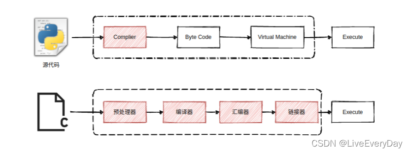

# Python

## Compile & Execute

事实上，Python 程序在执行过程中同样需要编译（Compile），编译产生的结果称之为字节码，而后由 Python 虚拟机逐行地执行这些字节码。所以，Python 解释器由两部分组成：编译器和虚拟机。

Python解释器把源代码转换成中间形式：字节码，然后由Python虚拟机来执行这些字节码。

Python是一门先编译后解释的语言。

当Python程序运行时，编译的结果保存到内存中的PyCodeObject中；当Python程序运行结束时，Python解释器则将PyCodeObject写回到pyc文件中。当Python程序第二次运行时，首先会在硬盘中寻找pyc文件，如果找到，则直接载入，否则重复上面的过程。所以说pyc文件其实是PyCodeObject的一种持久化保存方式。

pyc的目的是重用，Python解释器认为：只有import进来的模块，才是需要被重用的模块。pyc文件每次被载入时，都会检查它的最后修改日期（由PyCodeObject写入到pyc时会写入一个long型的日期），与py文件一致则直接使用，否则重新生成一份pyc文件。

## Scala解释器是什么原理？Scala是一种编译型的语言为啥会有类似python的交互式环境呢？

答：python是动态语言，并不需要编译直接通过python解释器一行一行的解释执行。Scala的交互式开发环境看上去与python的很像，但实际上两者原理是不同的。

Scala的解释器本质上并不是解释器，应该叫REPL即读取-求值-打印-循环。我们输入的代码被迅速的编译成字节码然后这段字节码由Java虚拟机执行。