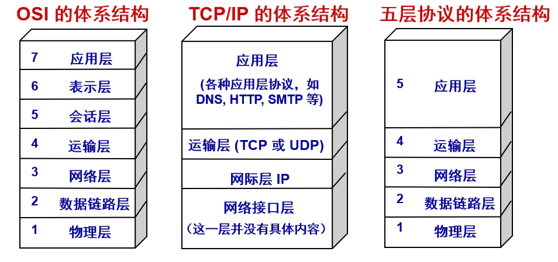

# 计算机网络

计算机网络体系
计算机网络体系结构分为3种：OSI体系结构（七层），TCP/IP体系结构（四层），五层体系结构。

OSI体系结构: 概念清楚，理论也比较完整，但是它既复杂又不实用。
TCP/IP体系结构:TCP/IP是一个四层体系结构，得到了广泛的运用。
五层体系结构:为了方便学习，折中OSI体系结构和TCP/IP体系结构，综合二者的优点，这样既简洁，又能将概念讲清楚。

## 五层网络体系结构概述
看一下五层网络体系结构各层的主要功能：

 应用层：应用层是网络协议的最高层，主要任务通过进程间的交互完成特定网络应用。应用层协议定义的是应用程序（进程）间通信和交互的规则。
 
对于不同的网络应用需要有不同的应用层协议，在互联网中的应用层协议很多，如域名系统DNS，支持万维网应用的HTTP协议，支持电子邮件的SMTP协议，等等。应用层交互的数据单元称为报文。
 
 运输层：有时也译为传输层，它负责为两台主机中的进程提供通信服务。该层主要有以下两种协议：
 
传输控制协议 (Transmission Control Protocol，TCP)：提供面向连接的、可靠的数据传输服务，数据传输的基本单位是报文段（segment）；
用户数据报协议 (User Datagram Protocol，UDP)：提供无连接的、尽最大努力的数据传输服务，但不保证数据传输的可靠性，数据传输的基本单位是用户数据报。
 网络层：网络层负责为分组网络中的不同主机提供通信服务，并通过选择合适的路由将数据传递到目标主机。在发送数据时，网络层把运输层产生的报文段或用户数据封装成分组或 包进行传送。
 
在TCP/IP体系中，由于网络层使用IP协议，因此分组也叫IP数据报。
 
 数据链路层：数据链路层通常简称为链路层。数据链路层在两个相邻节点传输数据时，将网络层交下来的IP数据报组装成帧，在两个相邻节点之间的链路上传送帧。
 
 物理层：保数据可以在各种物理媒介上进行传输，为数据的传输提供可靠的环境。

## TCP/IP体系结构概述
TCP/IP的体系结构比较简单，只有四层。

|层次名称|单  位|功  能|协  议|
|--|--|--|--|
|网络接口|帧|负责实际数据的传输，对应OSI参考模型的下两层|HDLC（高级链路控制协议）PPP（点对点协议） SLIP（串行线路接口协议）|
|网络层|数据报|负责网络间的寻址数据传输，对应OSI参考模型的第三层|IP（网际协议） ICMP（网际控制消息协议）ARP（地址解析协议） RARP（反向地址解析协议）|
|传输层|报文段|负责提供可靠的传输服务，对应OSI参考模型的第四层|TCP（控制传输协议） UDP（用户数据报协议）|
|应用层||负责实现一切与应用程序相关的功能，对应OSI参考模型的上三层|FTP（文件传输协议） HTTP（超文本传输协议） DNS（域名服务器协议）SMTP（简单邮件传输协议）NFS（网络文件系统协议）|

## 三种模型对比

https://github.com/balloonwj/CppGuide/blob/master/articles/%E7%BD%91%E7%BB%9C%E7%BC%96%E7%A8%8B/TCP%E5%8D%8F%E8%AE%AE%E5%A6%82%E4%BD%95%E8%A7%A3%E5%86%B3%E7%B2%98%E5%8C%85%E3%80%81%E5%8D%8A%E5%8C%85%E9%97%AE%E9%A2%98.md

TCP 协议如何解决粘包、半包问题