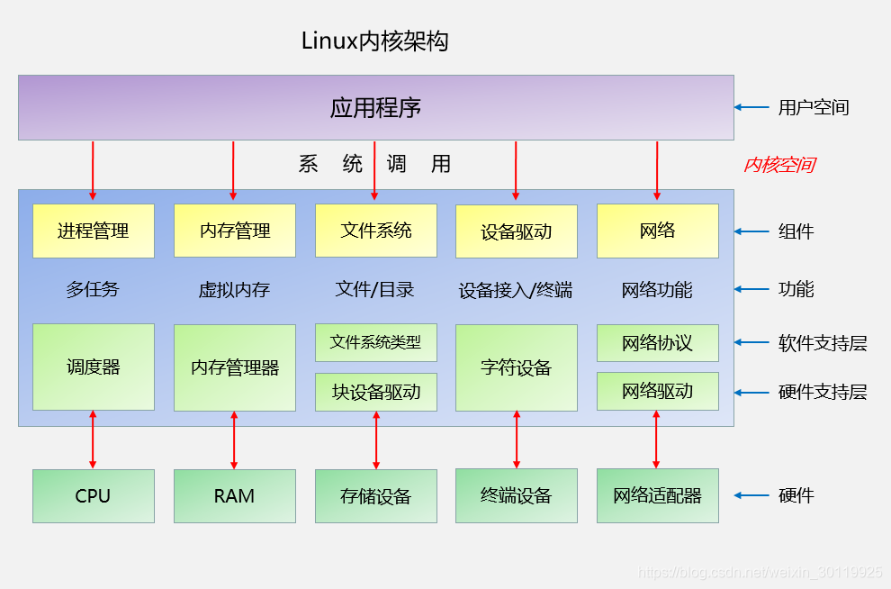

# linux

内核是操作系统的核心，具有很多最基本功能，它负责管理系统的进程、内存、设备驱动程序、文件和网络系统，决定着系统的性能和稳定性。

Linux 内核由如下几部分组成：内存管理、进程管理、设备驱动程序、文件系统和网络管理等。如图：

系统调用接口：SCI 层提供了某些机制执行从用户空间到内核的函数调用。这个接口依赖于体系结构，甚至在相同的处理器家族内也是如此。SCI 实际上是一个非常有用的函数调用多路复用和多路分解服务。在 ./linux/kernel 中可以找到 SCI 的实现，并在 ./linux/arch 中找到依赖于体系结构的部分。

系统调用按功能大致可分为如下几类：

- 设备管理。完成设备的请求或释放，以及设备启动等功能。
- 文件管理。完成文件的读、写、创建及删除等功能。
- 进程控制。完成进程的创建、撤销、阻塞及唤醒等功能。
- 进程通信。完成进程之间的消息传递或信号传递等功能。
- 内存管理。完成内存的分配、回收以及获取作业占用内存区大小及地址等功能。

内存管理
《Linux 操作系统原理 — 物理内存》
《Linux 操作系统原理 — 虚拟内存》

进程管理
《Linux 操作系统原理 — 进程与线程管理》

文件系统
《Linux 操作系统原理 — 文件系统 — 文件系统的演进》
《Linux 操作系统原理 — 文件系统 —文件》
《Linux 操作系统原理 — 文件系统 — 存储布局》
《Linux 操作系统原理 — 文件系统 — 实现原理》
《Linux 操作系统原理 — 文件系统 — 管理与优化》

设备驱动程序
设备驱动程序是 Linux 内核的主要部分。和操作系统的其它部分类似，设备驱动程序运行在高特权级的处理器环境中，从而可以直接对硬件进行操作，但正因为如此，任何一个设备驱动程序的错误都可能导致操作系统的崩溃。设备驱动程序实际控制操作系统和硬件设备之间的交互。

设备驱动程序提供一组操作系统可理解的抽象接口完成和操作系统之间的交互，而与硬件相关的具体操作细节由设备驱动程序完成。一般而言，设备驱动程序和设备的控制芯片有关，例如，如果计算机硬盘是 SCSI 硬盘，则需要使用 SCSI 驱动程序，而不是 IDE 驱动程序。

网络接口
提供了对各种网络标准的存取和各种网络硬件的支持。网络接口可分为网络协议和网络驱动程序。网络协议部分负责实现每一种可能的网络传输协议。众所周知，TCP/IP 协议是 Internet 的标准协议，同时也是事实上的工业标准。

Linux 的网络实现支持 BSD Socket，支持全部的 TCP/IP 协议。Linux 内核的网络部分由 BSD 套接字、网络协议层和网络设备驱动程序组成。网络设备驱动程序负责与硬件设备通讯，每一种可能的硬件设备都有相应的设备驱动程序。

Shell
Shell 是操作系统的用户界面之一，提供了用户与内核进行交互操作的一种接口。它接收用户输入的命令并把它送入内核去执行，是一个命令解释器。另外，Shell 编程语言具有普通编程语言的很多特点，用这种编程语言编写的 Shell 程序与其他应用程序具有同样的效果。

目前主要有下列版本的 Shell：

Bourne Shell：是贝尔实验室开发的。
Bash：是 GNU 的 Bourne Again Shell，是 GNU 操作系统上默认的 Shell，大部分 Linux 的发行套件使用的都是这种 Shell。
Korn Shell：是对 Bourne Shell 的发展，在大部分内容上与 Bourne Shell 兼容。
C Shell：是 SUN 公司 Shell 的 BSD 版本。