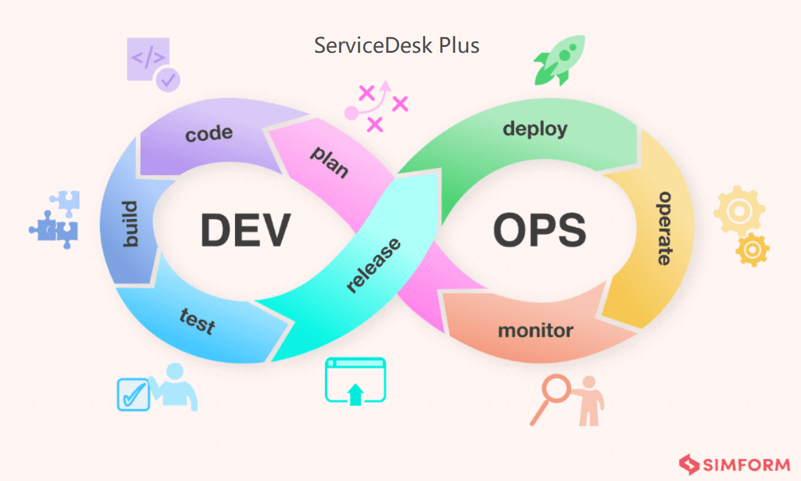

# DevOps

DevOps生命周期的八个阶段

1、计划：此初始阶段涉及确定项目目标和范围，开发团队和运营团队在此阶段合作，了解需求、确定优先级并规划工作流程。

2、代码：开发人员编写代码，创建新功能、修复错误或增强现有软件，并通过Git等版本控制系统管理和跟踪代码库的变更。

3、构建：将代码编译或转换为可执行程序，通常使用Jenkins、Maven或Gradle等工具。

4、测试：软件构建完成后，执行严格的测试，以发现并修复缺陷，包括单元测试、集成测试、系统测试和用户验收测试，使用Selenium或JUnit等自动化测试工具。

5、发布：准备应用程序部署到生产环境，包括最终质量保证、发布计划和日程安排。

6、部署：将新代码移入生产环境，使用Kubernetes等容器编排工具和Ansible、Puppet、Chef等配置管理工具。

7、运行：部署完成后，进行持续的维护和支持，如监控应用程序性能、确保可用性、实施更新或打补丁。

8、监控：持续监控以跟踪应用程序性能、发现问题并收集用户反馈，使用Prometheus、Nagios或Splunk等工具，捕获的洞察力和反馈用于未来能够做出改进的决策，这种反馈循环是 DevOps 迭代性质的关键。