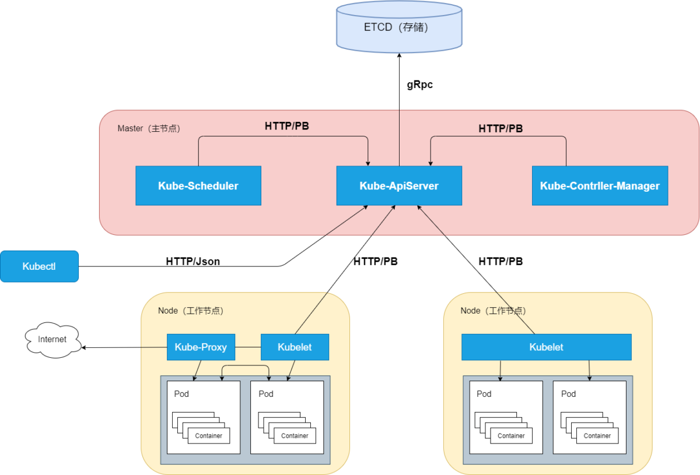

# Kubernetes

## Kubernetes总体架构

### kubectl & client-go 

#### kubectl

- kubectl 是kuberntes官方提供的命令行工具
- kubectl 以交互式命令行的方式，来与kube-apiserver组件交互，通信协议是 HTTP/JSON
- kubectl 发送HTTP请求，到kube-apiserver接收、处理并将结果反馈给kubectl。kubectl接收到响应并展示结果。

#### client-go

- client-go 是通过编程的方式与kube-apiserver进行交互，实现与kubectl相同的功能。
- client-go 简单、易用，Kubernetes系统的其他组件与kube-apiserver通信的方式也基于client-go实现
- 如果需要对kubernetes做二次开发，可以使用 client-go
- 熟练使用并掌握 client-go 对 k8s 的二次开发有着关键作用。

### Master节点组件

#### kube-apiserver

- Kubernetes集群中的所有组件都通过 kube-apiserver 组件操作资源对象。
- kube-apiserver 组件也是集群中唯一与 Etcd 集群进行交互的核心组件。
    - 例如：通过kubectl创建了一个Pod资源对象，请求通过kube-apiserver的HTTP接口将Pod资源对象存储至Etcd集群中。
    - Etcd集群是分布式键值存储集群，其提供了可靠的强一致性服务发现。
- Kubernetes 系统中的所有资源对象都封装成 RESTful 风格的 API 接口进行管理。
- 拥有丰富的集群安全访问机制，以及认证、授权及准入控制器。
- 提供了集群各组件的通信和交互功能。

#### kube-controller-manager

- kube-controller-manager 负责管理Kubernetes集群中的节点（Node）、Pod 副本、服务、端点（Endpoint）、命名空间（Namespace）、服务账户（ServiceAccount）、资源定额（ResourceQuota）等。
    - 当某个节点意外宕机时，Controller Manager会及时发现并执行自动化修复流程，确保集群始终处于预期的工作状态。
- kube-controller-manager 负责确保 Kubernetes 系统的实际状态收敛到所需状态。
    - 控制器的管理。例如 DeploymentControllers 控制器、StatefulSet 控制器、Namespace 控制器及 PersistentVolume 控制器等。
    - 控制器通过 kube-apiserver 组件提供的接口实时监控整个集群每个资源对象的当前状态，当因发生各种故障而导致系统状态出现变化时，会尝试将系统状态修复到“期望状态”。
- kube-controller-manager 具备高可用性（即多实例同时运行）
    - 即基于Etcd集群上的分布式锁实现领导者选举机制，多实例同时运行，通过 kube-apiserver 提供的资源锁进行选举竞争。
    - 抢先获取锁的实例被称为 Leader 节点（即领导者节点），并运行 kube-controller-manager 组件的主逻辑；
    - 而未获取锁的实例被称为 Candidate 节点（即候选节点），运行时处于阻塞状态。
    - 在Leader节点因某些原因退出后，Candidate 节点则通过领导者选举机制参与竞选，成为 Leader 节点后接替 kube-controller-manager 的工作。

#### kube-scheduler

- kube-scheduler 称为调度器，是Kubernetes集群的默认调度器。负责在Kubernetes集群中为一个Pod资源对象找到合适的节点并在该节点上运行。
    - kube-scheduler 监控整个集群的Pod资源对象和Node资源对象，当监控到新的Pod资源对象时，会通过调度算法为其选择最优节点。
    - 调度算法分为两种，分别为预选调度算法和优选调度算法。除调度策略外，Kubernetes还支持优先级调度、抢占机制及亲和性调度等功能。
- kube-scheduler 支持高可用性（即多实例同时运行）
    - 基于 Etcd 集群上的分布式锁实现领导者选举机制，多实例同时运行，通过kube-apiserver 提供的资源锁进行选举竞争
    - 竞选机制与 kube-controller-manager 组件相同

### Node 节点组件

#### kubelet

- kubelet 组件运行在 Node 节点上，用于管理节点。
- kubelet 组件的作用主要有：
    - 接收、处理、上报 kube-apiserver 组件下发的任务。
    - kubelet 进程启动时会向 kube-apiserver 注册节点自身信息。
    - kubelet 主要负责所在节点（Node）上的Pod资源对象的管理，例如Pod资源对象的创建、修改、监控、删除、驱逐及Pod生命周期管理等。
    - kubelet 组件会定期监控所在节点的资源使用状态并上报给 kube-apiserver 组件，这些资源数据可以帮助 kube-scheduler 调度器为 Pod 资源对象预选节点。
    - kubelet也会对所在节点的镜像和容器做清理工作，保证节点上的镜像不会占满磁盘空间、删除的容器释放相关资源。
- kubelet组件实现了3种开放接口：
    - Container Runtime Interface(CRI) : 容器运行时接口，提供容器运行时通用插件接口服务。
        - CRI 定义了容器和镜像服务的接口
        - CRI 将 kubelet 组件与容器运行时进行解耦，将原来完全面向 Pod 级别的内部接口拆分成面向 Sandbox 和 Container 的 gRPC 接口，并将镜像管理和容器管理分离给不同的服务。
        - CRI 是 K8S 定义的一套容器运行时接口，基于 gRPC 通讯，但是 docker 不是基于 CRI 的，因此 kubelet 又把 docker 封装了一层，搞了一个所谓的shim，也即是 dockershim 的东西，dockershim 作为一个实现了 CRI  接口的 gRPC 服务器，供 kubelet 使用。
        - 这样的过程其实就是，kubelet 作为客户端 通过 gRPC 调用 dockershim 服务器，dockershim 内部又通过 docker 客户端走 http 调用 docker daemon api，多走了一次通讯的开销。下图是目前默认使用 docker 作为容器引擎的时候，调用过程。
    - Container Network Interface(CNI) : 容器网络接口，提供网络通用插件接口服务。
        - CNI 定义了 Kubernetes 网络插件的基础，容器创建时通过 CNI 插件配置网络。
        - CNI 仅关心容器创建时的网络分配，和当容器被删除时释放网络资源。
        - CNI 的主要功能就是： 为容器分配IP地址、不同容器之间的互通
    - Container Storage Interface(CSI) : 容器存储接口，提供存储通用插件接口服务。
        - CSI 定义了容器存储卷标准规范，容器创建时通过 CSI 插件配置存储卷。
        - CSI 可以用来创建动态卷，但是需要安装对应的 CSI 插件，例如，使用 NFS 插件，来动态创建 pv ，
        - CSI 持久化卷具有以下字段可供用户指定： driver（指定要使用的卷驱动程序的名称），volumeHandle（唯一标识从 CSI 卷插件的 CreateVolume 调用返回的卷名），readOnly（可选，指示卷是否被发布为只读）。

#### kube-proxy

- kube-proxy 运行在 Node 节点上，是 Node 节点的网络代理。
- kube-proxy 监控 kube-apiserver 的服务和端点资源变化，并通过 iptables/ipvs 等配置负载均衡器，为一组 Pod 提供统一的 TCP/UDP 流量转发和负载均衡功能。
- kube-proxy 用来完成Pod-to-Service 和 External-to-Service 网络治理，对于某个 IP：Port 的请求，负责将其转发给专用网络上的相应服务或应用程序。
- kube-proxy 组件与其他负载均衡服务的区别在于，kube-proxy 代理只向 Kubernetes 服务及其后端 Pod 发出请求。

## K8s autoscaler

https://kingjcy.github.io/post/cloud/paas/base/kubernetes/k8s-autoscaler/

kubernetes简介及架构图

https://www.cnblogs.com/caodan01/p/15102328.html

https://www.guoshaohe.com/cloud-computing/kubernetes-source-read/1249

源码解析：K8s 创建 pod 时，背后发生了什么（一）（2021）
源码解析：K8s 创建 pod 时，背后发生了什么（二）（2021）
源码解析：K8s 创建 pod 时，背后发生了什么（三）（2021）
源码解析：K8s 创建 pod 时，背后发生了什么（四）（2021）
源码解析：K8s 创建 pod 时，背后发生了什么（五）（2021）
https://arthurchiao.art/blog/what-happens-when-k8s-creates-pods-5-zh/#65-%E4%B8%BA%E5%AE%B9%E5%99%A8%E9%85%8D%E7%BD%AE%E8%B7%A8%E8%8A%82%E7%82%B9%E9%80%9A%E4%BF%A1%E7%BD%91%E7%BB%9Cinter-host-networking

https://developer.aliyun.com/article/798703

我们将 CRD, Controller, Webhook 三者合起来叫 Operator。一个 Operator 工程一般必须包含 CRD 和 Controller，Admission 是可选的。如果说 Kubernetes 是 "操作系统" 的话，Operator 是 Kubernetes 的第一层应用，它部署在 Kubernetes 里，使用 Kubernetes "扩展资源" 接口的方式向更上层用户提供服务。
Operator的实现方式主要包括OperatorSDK和KubeBuilder，目前KubeBuilder在阿里使用的比较多。
KubeBuilder
OperatorSDK